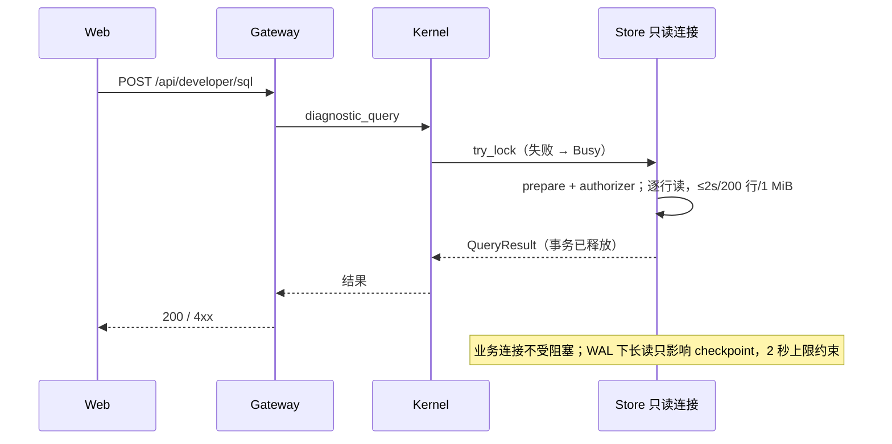

# B2：Web 开发者诊断（日志 + 只读 SQL）

**状态：CLOSED（2026-10-10，网页与服务器人工验收通过）。合并原日志 B2 r2 与只读 SQL 方向；不依赖[更新重启](self-update.md)。**

依据：[日志 B1](../brainstorm/developer-logs.md)、[SQL B1](../brainstorm/developer-sql.md)。个人开发者在网页上排查服务器问题：看实时日志，查数据库，不再登服务器。两项后端独立变化，只共用页面入口与鉴权。

## 一、用户行为

侧栏新增“开发者诊断”，路由 `/developer`，页内两个页签：

- **日志**：本进程内存日志，实时跟随；普通文本/正则搜索、级别与模块筛选、暂停滚动、回到底部、复制当前筛选结果。重启清空。
- **SQL**：输入一条只读 SQL，执行后显示表格、耗时与截断提示，可复制结果；左侧列出表与列供参考。凭据列显示为 NULL。

都不新增 config.toml 或 SQLite 设置项；固定上限放各自 crate 的 limits.rs。`-p` 不受影响。

## 二、日志

### 2.1 采集范围

- 项目模块采 DEBUG/INFO/WARN/ERROR，依赖只采 INFO/WARN/ERROR，不采 TRACE。项目归属：event `Metadata::module_path` 第一段为 `micnext` 或以 `mic_` 开头；其余或无 module_path 视为依赖。新增项目 crate 无需登记。
- 终端继续按 RUST_LOG，与内存层各自过滤；不得把 RUST_LOG 设为全局过滤，也不得用 release_max_level_info 等 feature 编译期排除 DEBUG。
- 只采已有 tracing event：不新增聊天/工具输出埋点，不捕获 stderr、panic hook 或子进程输出。聊天原文可见，不声称日志已脱敏。凭据（bot_token、context_token 等）由 emit 侧遮蔽：DEBUG 常驻采集后，「仅 debug 级别输出」不再构成隐藏，Gateway/UI 不猜测脱敏。

### 2.2 Rust 公开契约（mic-gateway re-export）

```rust
#[derive(Clone)]
pub struct DeveloperLogs { /* private */ }

impl DeveloperLogs {
    pub fn new() -> Self;
    pub fn layer<S>(&self)
        -> impl tracing_subscriber::Layer<S> + Send + Sync + 'static
    where S: tracing::Subscriber + for<'a> tracing_subscriber::registry::LookupSpan<'a>;
}

pub struct GatewayModule { /* private logs: DeveloperLogs */ }

impl GatewayModule {
    pub fn new(logs: DeveloperLogs) -> Self;
}
// impl mic_core::Module 不变。
```

`LookupSpan` 约束为 per-layer filter 所需（实现时补，main 的 Registry 满足）。`new` 只建空缓冲与通知源，无 I/O、无随机数、不预分配；clone 共享同一缓冲。`layer` 自带 §2.1 的 per-layer filter，不记录 span 生命周期/字段，自身不 emit 日志。

main：Serve 创建缓冲、安装内存层并传给 GatewayModule；Once 同样传 `DeveloperLogs::new()` 但不安装内存层（Once 不运行 Gateway Service，缓冲始终为空）。无 Option、无“缺缓冲”运行时错误。唯一构造调用方 `bin/micnext/src/main.rs` 与接口同一变更一次迁移，不加临时 API，不搬 GatewayModule 文件。

依赖：mic-gateway 新增外部 `tracing-subscriber = 0.3`（registry）；无内部跨 crate 依赖变化。

### 2.3 缓冲与读取

- 上限（Gateway limits.rs）：10,000 条、文本合计 16 MiB、单条 16 KiB、单条最多 128 字段、每批读取 128 条。
- 内部 LogRecord：timestamp_ms、level（Debug/Info/Warn/Error）、target、message、fields（name/value 展示文本）、file/line（来自 Metadata）、truncated。字段经 tracing Visit 在 emit 边界一次有界格式化，UTF-8 字符边界截断并标记；禁止先格式化无界 String 再截。
- 同步短锁内分配内部递增 seq、追加、按条数/字节淘汰最旧，再通知 watch。锁内不等网络、不序列化、不 emit。锁中毒等不变量失败不静默继续。
- 每连接：先订阅通知，再在短锁内取保留记录的 Arc 快照与末尾 seq；回放快照后按 seq 每批取 128 条跟随。实时阶段若未读记录已被淘汰则结束连接，让页面重连重放。seq 不发给浏览器。

### 2.4 HTTP/SSE

GET `/api/developer/logs/stream`，无 query，Bearer 鉴权，`Cache-Control: no-store`；未知 query 400。复用既有 15s 心跳与 shutdown grace。

```json
// event: ready
{"retained_count":10000,"history_trimmed":true}
// event: log
{"timestamp_ms":1791590400000,"level":"debug","target":"mic_channel_wechat::client",
 "message":"wechat inbound quote","fields":[{"name":"ref_msg","value":"..."}],
 "file":"crates/mic-channel-wechat/src/client.rs","line":352,"truncated":false}
```

level 严格四值；line 为 u32 或 null。前端两个强类型 decoder；未知事件/协议错误停止连接并提示。SSE 分帧从现有 readStream 私有提取，会话流签名与事件不变。

### 2.5 页面

- 浏览器同样最多 10,000 条/16 MiB；最多渲染 500 条匹配记录：跟随时显示最近 500 条，暂停后按 500 条前后翻；文本不解释 HTML。
- 过滤 = 级别集合 AND 精确 target AND 搜索（正文、target、字段名值）。普通文本不区分大小写；正则 `u`、可选 `i`。查询最多 512 字符、debounce 200ms；非法正则提示并保留上一有效筛选。搜索框下拉列出浏览器本地最近 20 条搜索（回车或失焦时记录有效搜索，只记文字不记正则开关）。不加 worker，接受复杂正则卡页。
- 暂停/上翻只停跟随，继续接收；视图锚定在当前首条记录（页面内编号），新日志与淘汰不移动正在看的内容；锚点被淘汰时提示并从最早保留记录显示。两页签切换不销毁，筛选、暂停位置、SQL 草稿与结果在页面生命周期内保留。复制全部匹配记录（含未渲染页），截断项带标记，失败明确提示。
- 断线或流结束按 1/2/4/8/10s 退避重连，收到 ready 清空重放；401 走 auth.expire；400/协议错误停自动重试，提供手动重连。页面写明“内存日志，重启清空；重连重新加载最近窗口”。

## 三、只读 SQL

### 3.1 所有权

数据库文件只由 mic-store 知道，诊断查询也放 mic-store：Store 在 `open` 时额外打开一条**只读连接**（`SQLITE_OPEN_READ_ONLY`），装好 authorizer，与业务连接各自一把锁。诊断不占业务连接 Mutex；只读连接的 `try_lock` 失败即“已有查询在跑”，不排队。打开失败启动报错。`open_in_memory`（仅测试用）不建只读连接，查询返回 `Unavailable`。

经 Kernel 透传给 Gateway，与现有设置/模型接口同路；core 不新增 port。

### 3.2 凭据列由建表方声明

`Migration` 新增字段，声明本次迁移引入的明文凭据列：

```rust
pub struct Migration {
    pub module: &'static str,
    pub version: u32,
    pub sql: &'static str,
    pub secret_columns: &'static [SecretColumn],
}

pub struct SecretColumn {
    pub table: &'static str,
    pub column: &'static str,
}
```

Store 汇总全部已注册迁移的声明；authorizer 对这些列的 `SQLITE_READ` 返回 `SQLITE_IGNORE`，结果读作 NULL（含经视图、子查询、`SELECT *`）。调用方共 6 处字面量：core 5 处为 `&[]`（API key 已加密存 `key_cipher`，只显示 BLOB 大小）；wechat 1 处声明 `wechat_account.bot_token`、`wechat_state.context_token`。

### 3.3 执行边界

authorizer 白名单：`SELECT`、`READ`（凭据列 IGNORE）、`FUNCTION`、`RECURSIVE`；其余一律 DENY（写、DDL、ATTACH、PRAGMA、事务控制等）。只读打开是第二道防线。不用前缀或正则判断 SQL。rusqlite `prepare` 遇多条语句报错，即单条约束。

每次查询装 progress handler，每 1000 条 VM 指令检查一次，超过 2 秒即中断；这不是硬墙钟期限，单条长指令（如大排序、生成巨值）可超出。连接设 `SQLITE_LIMIT_LENGTH` 32 MiB（大于库内图片上限），拦住 printf/zeroblob 生成的巨值。逐行读取：读入下一行会超过 200 行或累计文本 1 MiB 时，不复制该行，停止并标记截断（首行即超限时结果为空，页面提示用 substr 截取）；statement 与读事务在返回前释放，结果传输不持有事务。需要给 mic-store 的 rusqlite 打开 `hooks`、`limits` feature。

```rust
// mic-store re-export，经 mic-core 透传
pub struct QueryResult {
    pub columns: Vec<String>,
    pub rows: Vec<Vec<Cell>>,
    pub truncated: bool,
    pub elapsed_ms: u64,
}

pub enum Cell {
    Null,
    Integer(i64),
    Real(f64),
    Text(String),
    Blob { bytes: u64 },
}

pub struct TableSchema {
    pub name: String,
    pub columns: Vec<ColumnSchema>,
}

pub struct ColumnSchema {
    pub name: String,
    pub decl_type: String,
    pub secret: bool,
}

#[derive(Debug, thiserror::Error)]
pub enum DiagnosticError {
    #[error("已有查询在执行")]
    Busy,
    #[error("查询超过 2 秒已中断")]
    Timeout,
    #[error("SQL 有误或不允许：{0}")]
    Rejected(String),
    #[error("当前数据库不支持诊断查询")]
    Unavailable,
    #[error(transparent)]
    Store(#[from] StoreError),
}

impl Store {
    pub async fn diagnostic_query(&self, sql: String) -> Result<QueryResult, DiagnosticError>;
    pub async fn diagnostic_schema(&self) -> Result<Vec<TableSchema>, DiagnosticError>;
}
```

`Rejected` 携带 SQLite 原错误文本（语法错误、not authorized 等）；`Store` 为连接/内部失败。表结构由 Store 在业务连接上读 sqlite_schema 与 `pragma_table_info` 生成（一次短查询），凭据标记取自 §3.2 声明；只读连接的 authorizer 不为它放开 PRAGMA。Kernel 新增同名两个方法，错误为 `KernelError::Diagnostic(DiagnosticError)`。

### 3.4 HTTP

均 Bearer 鉴权、`no-store`：

| API | 请求 | 响应 |
|---|---|---|
| POST `/api/developer/sql` | `{"sql":"..."}`，≤16 KiB，未知字段 400 | 200 QueryResult |
| GET `/api/developer/sql/schema` | 无 query | 200 `[{"name","columns":[{"name","decl_type","secret"}]}]` |

```json
{"columns":["message_id","external_message_id"],
 "rows":[[{"type":"integer","value":"203"},{"type":"text","value":"7514528105921239688"}]],
 "truncated":false,"elapsed_ms":3}
```

Cell 为 tagged：`null`、`integer`（十进制字符串，避免 JS 精度丢失）、`real`（字符串，Rust `{:?}` 格式，含 `inf`/`-inf`；JSON number 无法表示非有限值）、`text`、`blob`（`bytes` 数字）。错误 `{"error":"中文原因"}`：400 Rejected/Timeout/请求非法，409 Busy，503 Unavailable，500 Store。

### 3.5 页面

SQL 输入框（复用 highlight.js 语法高亮，与结果区之间可拖动调高度并按浏览器记住；Ctrl/Cmd+Enter 执行）、结果表格、耗时、截断提示、复制为 Markdown 表格、下载 CSV（RFC 4180，NULL 为空字段，带 UTF-8 BOM）；左侧表与列列表，凭据列标注“已隐藏”。浏览器本地记住最近 30 条成功执行的 SQL（左侧「最近」，点选只填回不执行）；不做收藏，不导出整库。

## 四、实体与场景

| 实体 | 唯一写者 | 状态 |
|---|---|---|
| 日志缓冲/seq | 采集层 | 空 → 保留/淘汰 → 进程消失 |
| 日志连接 | 单连接 Gateway 任务 | 订阅 → 快照回放 → 实时 → 结束 |
| 只读连接 | Store 诊断方法 | 空闲 ↔ 执行（独占）；超时中断后回空闲 |
| 业务数据库 | 现有 Store/迁移 | 不变；诊断无写权限 |
| 页面状态 | 各页签状态对象 | 日志：连接 ↔ 重连，跟随 ↔ 暂停；SQL：空闲 ↔ 执行 |



日志场景见 §2.3：emit → 缓冲 → 通知 → 连接按 seq 批读 → 页面；emit 不等页面。

不变量：诊断不写库、不读出声明的凭据列、不占业务连接锁；查询有时间/行数/字节上限，传输不持事务；日志采集不等客户端，终端过滤与原行为等价。

## 五、兼容

| 调用方/边界 | 判定 |
|---|---|
| main 的 `GatewayModule` unit 构造 | 改为 `new(logs)`，一次迁移 |
| 6 处 `Migration` 字面量 | 补 `secret_columns`，一次迁移；无其它构造方 |
| Store::open / open_in_memory | 签名不变；open 多开只读连接，失败启动报错 |
| Kernel / KernelError | 新增两方法与一个变体；Gateway 对 KernelError 的匹配需补该分支 |
| Module/Assembly/Channel/Provider/工具 | 无变化 |
| 终端/RUST_LOG、`-p` | 行为等价；项目 DEBUG 实际求值：保留容量有界（条数/字节），但 emit 表达式本身的格式化与分配在采集截断前已发生，执行开销随埋点而定 |
| 会话 SSE、Web auth、复制 | 复用，事件不变 |
| 数据库 schema/文件 | 无迁移、不写盘 |

## 六、实现顺序与验收

批准后：Migration/Store 只读查询 → Kernel 透传 → GatewayModule 与日志缓冲/流 → SQL API → 前端页面 → 验收 → CLOSED、更新 todo。

日志验收（合成 event，不加生产注入 API）：
1. `RUST_LOG=warn` 启动：项目 DEBUG 网页可见、终端不见；依赖 DEBUG 不见、依赖 INFO 可见；`-p` 原样。
2. 截断标记、条数/字节淘汰、快照到实时无漏无重、慢连接被断后重放、重启清空。
3. 401、未知 query 400、HTML 纯文本；筛选/正则/暂停/翻页/复制范围一致；会话 SSE 正常。

SQL 验收：
1. `SELECT message_id, external_message_id FROM wechat_delivery_attempt WHERE message_id = 203` 正常返回；大整数为字符串。
2. `SELECT * FROM wechat_account` 的 bot_token 为 NULL；经子查询/视图同样为 NULL。
3. INSERT/UPDATE/DELETE/CREATE/ATTACH/PRAGMA/多语句均 400；`WITH RECURSIVE` 死循环 2 秒内 Timeout；大表截断标记；并发第二个查询 409。
4. 查询期间微信收发与网页聊天不受阻塞。

收尾 `cargo fmt`、`cargo clippy -- -D warnings`、`bun run --cwd web check`、`bun run --cwd web build`；改动覆盖已有测试才跑对应测试。

## 七、依据

[tracing-subscriber per-layer filtering](https://docs.rs/tracing-subscriber/latest/tracing_subscriber/layer/index.html)、[SQLite authorizer](https://www.sqlite.org/c3ref/set_authorizer.html)、[progress handler](https://www.sqlite.org/c3ref/progress_handler.html)、[WAL](https://www.sqlite.org/wal.html)。
