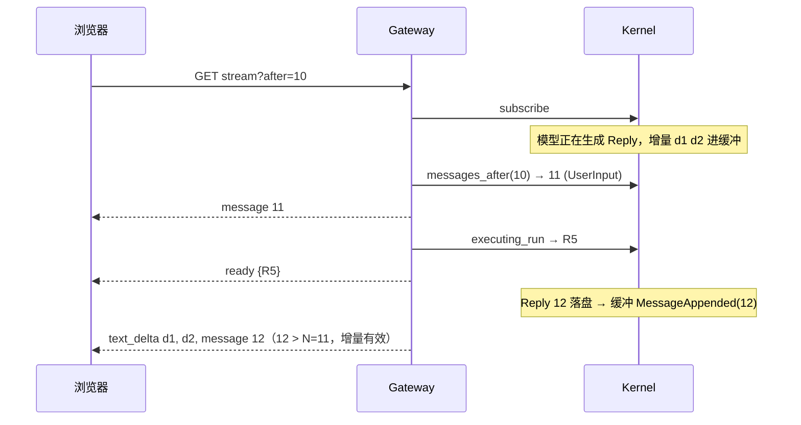

# B2: 网关（mic-gateway，M9）

**状态**: CLOSED（2026-09-24 批准并实现于 `crates/mic-gateway`；§八 1～9 用 curl/脚本与 DeepSeek 实跑通过）；2026-10-08 按 [`runtime-settings.md`](runtime-settings.md) §六 加设置与人设接口、会话人设，`workdir` 移到网页设置
**来源**: [`v0a-module-map.md`](v0a-module-map.md) M9、§二 对接方式与 v0a 简化；
[`product-roadmap.md`](../brainstorm/product-roadmap.md) §2.2、§2.5、§四-2
**依赖不变量**: `mic-channel-web` 改名 `mic-gateway`，依赖 `mic-core`（port）+ `mic-store`（会话/run 类型）+
`mic-message`；不被任何 crate 依赖，只由二进制装配。本文同时修订 `mic-core`（`Kernel` 只读委托，§三.2）
与 `mic-store`（`executing_run`，§三.3），合成一份。

## 〇、已定方向（2026-09-24 与 human 确认）

| # | 问题 | 决定 |
|---|---|---|
| Q1 | 谁能访问 | 默认只本机（`127.0.0.1`）。部署到服务器时改为登录制（邮箱验证码 / 微信扫码等，登录后本机 cookie 保持一段时间），另起 B2 |
| Q2 | token | 配置里写了 `token` 就固定用它；没写则每次启动随机生成。启动时在终端打印带 token 的访问地址 |
| Q3 | Web 新会话的工作目录 | 取网页 设置 → 对话偏好 的「新会话默认工作目录」（缺省 `~/workspace/mic`，runtime-settings）；新建会话时自选目录以后再做 |
| Q4 | 新建会话 | 发第一条消息时才创建，列表里没有空会话 |
| Q5 | 停止按钮 | v0a 不做 |
| Q6 | 用量显示 | v0a 不做，随路线图 v1 |
| Q7 | 在 Web 看其它 Channel 的会话 | 接口支持只读查看（列表带 `channel` 参数），只有 `web` 会话能发消息；界面上默认折叠（M10） |

## 一、用户视角的效果

- 直接运行 `micnext` 就起 Web 服务，终端打印带 token 的访问地址，点开即用。配置里固定了 token 时地址不变；
  没固定则每次启动换一个，旧页面要用新地址重新打开。
- 页面（M10）凭 token 调接口：看会话列表（最近活跃在前，带首句预览），点开一个会话看完整历史，
  发消息后回复逐字流出，推理和工具调用实时可见。
- agent 干活时可以继续发消息，新消息立即出现在历史里，在下一次调用模型前并入当前这轮。
- 刷新页面、切走再回来、断网重连、服务重启：历史不丢、不重复；正在生成的那段从接入时刻接着显示，
  生成完以落盘内容为准。
- 打开一个正在执行的会话，能看出它还在跑。

## 二、范围

本文定：配置段、鉴权、HTTP 接口与 JSON 形状、SSE 流与回放交接、错误映射、`Kernel`/`mic-store` 为此新增的
只读方法。不定：前端与静态资源嵌入（改归 M10，本模块不再承担"嵌入前端产物"，模块地图随本文修订）；
附件上传（roadmap §四-7）；微信接入（v0b）；停止、用量（Q5、Q6）。

## 三、公开接口

### 3.1 crate

```rust
pub struct GatewayModule;   // Module::name() = "gateway"，activation = Always
```

`install` 解析 `[gateway]`（没有该段收到空表），登记一个 `Service`。Service 类型不公开。

配置：

```toml
[gateway]
listen = "127.0.0.1:7878"     # 可省略，缺省即此值
# token = "…"                 # 访问口令，可省略：省略时每次启动随机生成
```

- 未知字段、`listen` 不是 `ip:port` → `install` 报错（启动失败）；仍写着已移走的 `workdir` → 报错指明删除。
- `token` 写了但为空白 → `install` 报错。没写 → Service 启动时生成 32 字节随机值（十六进制）。
- Service 启动时：绑定端口，占用 → 返回错误，文案说明改 `listen`；
  成功后在 stderr 打印 `Web 已启动：http://<listen>/#token=<token>`（面向用户的提示，不进 tracing 日志；
  `#` 片段不会发给服务端，前端读取后自存）。
- 配置模板（`bin/micnext/src/default-config.toml`）加入注释说明的 `[gateway]` 段，不写 token。

### 3.2 `mic-core` 修订：`Kernel` 只读委托

Gateway 不直接持有 Store（模块地图 §二），经 `Kernel` 读：

```rust
impl Kernel {
    /// 不存在返回 `None`（id 来自外部）。
    pub async fn session(&self, id: SessionId) -> Result<Option<Session>, KernelError>;
    pub async fn list_root_sessions(&self, channel: &str, before: Option<SessionCursor>,
        limit: NonZeroU32) -> Result<SessionPage, KernelError>;
    pub async fn messages_after(&self, session: SessionId, after: Option<MessageId>)
        -> Result<Vec<Message>, KernelError>;
    /// 该会话正在执行的 run。
    pub async fn executing_run(&self, session: SessionId) -> Result<Option<RunId>, KernelError>;
}
```

全部是 Store 同名方法的直通，不加语义。

### 3.3 `mic-store` 修订

```rust
impl Store {
    /// 会话的 `executing` run（不变量 1 保证至多一个），走 `idx_runs_executing`。
    pub async fn executing_run(&self, session: SessionId) -> Result<Option<RunId>, StoreError>;
}
```

### 3.4 build 后不改的旋钮（`src/limits.rs`）

| 常量 | 值 | 含义 |
|---|---|---|
| `MAX_TEXT_CHARS` | 100 000 | 一条消息的最大字符数 |
| `MAX_BODY_BYTES` | 1 MiB | 请求体上限 |
| `PAGE_DEFAULT` / `PAGE_MAX` | 30 / 100 | 会话列表每页条数 |
| `SSE_KEEPALIVE` | 15 s | SSE 心跳注释间隔 |
| `SHUTDOWN_GRACE` | 3 s | 停止后等连接自行关闭的上限 |

## 四、HTTP 接口

所有接口在 `/api` 下，JSON，UTF-8。`/api` 下未知路径返回 404；`/api` 之外是 Web 前端静态资源，规则见 [`web-ui.md`](web-ui.md) §三。

### 4.1 鉴权

- 每个请求带 `Authorization: Bearer <token>`，常数时间比较；缺失或不符 → 401。
- 固定 token 即 owner（模块地图 §二），可操作范围 = 本文全部接口。
- 不设 cookie、不做 CORS（同源页面）。前端用 `fetch` 读流（`EventSource` 不能带请求头），故 SSE 同样走 Bearer。
- 日志不记 token、消息正文。

### 4.2 接口表

| 方法与路径 | 请求 | 成功响应 |
|---|---|---|
| `GET /api/sessions?channel=web[&before_at=…&before_id=…][&limit=…]` | `before_at`/`before_id` 同有同无 | 200 `SessionPage` |
| `GET /api/sessions/{id}` | — | 200 `SessionItem`；不存在或非 Root → 404 |
| `POST /api/sessions` | `{"text": "…"}` | 201 `{"session_id": 3, "message_id": 12}` |
| `POST /api/sessions/{id}/messages` | `{"text": "…"}` | 202 `{"message_id": 13}` |
| `GET /api/sessions/{id}/stream[?after=<message_id>]` | — | 200 `text/event-stream`（§五） |

- `POST /api/sessions`：生成随机 `chat`，以设置里的默认工作目录（展开 `~/`，不存在则创建）、`ToolScope::All`、无投递目标调
  `resolve_root_session("web", chat, …)`，再 `append_user_input(owner, [Text])`。两步不在一个事务：
  第二步失败会留下一个没有输入的会话，它不进列表（mic-store §4.6），无害。
- `POST …/messages`：会话须是 `Root{channel: "web"}`；其它 Channel 或非 Root → 403（Q7：只读查看）。
  同一判定以 `SessionItem.writable` 告诉前端，前端不自己推断。
- `GET /api/sessions/{id}`：打开的会话页按 id 取自身信息，不依赖左栏分页是否加载到它。
- 发消息接口只写入并唤醒，不等回复；回复从流里来。

JSON 形状（字段名即契约，M10 照此写 TS 类型）：

```jsonc
// SessionItem
{ "id": 3, "channel": "web", "created_at": 1760000000000, "last_activity_at": 1760000005000,
  "preview": "列出当前目录", "workdir": "/Users/x", "writable": true, "persona_id": 1 }
// SessionPage
{ "items": [SessionItem], "next": { "before_at": 1760000005000, "before_id": 3 } | null }
// Message：mic-message `Message` 的 serde 形状原样输出（`body` 为 `MessageBody`，内部标签 `kind`）
```

`Message` 直接复用 mic-message 的 serde，不另起 DTO：前端要的就是完整消息，一处真相；
mic-message 形状变化即 wire 变化，由改 mic-message 的 B2 列 M10 为调用方。

### 4.3 错误

响应 `{"error": "<中文说明>"}`：

| 情况 | 状态 |
|---|---|
| token 缺失或不符 | 401 |
| 请求体不是合法 JSON / 缺字段 / 未知字段 / `text` 为空白 / 分页参数不成对 | 400 |
| `text` 超过 `MAX_TEXT_CHARS` 或请求体超过 `MAX_BODY_BYTES` | 413 |
| 会话不存在 | 404 |
| 往非 web 会话发消息 | 403 |
| `KernelError` | 500，日志记详情，响应只写"内部错误" |

设置、人设与会话人设接口及其错误映射见 runtime-settings §六。

## 五、SSE 流与回放交接

### 5.1 事件

| SSE `event` | `id` | `data` |
|---|---|---|
| `message` | 消息 id | `Message` |
| `text_delta` | — | `{"text": "…"}` |
| `reasoning_delta` | — | `{"text": "…"}` |
| `draft_discarded` | — | `{}` |
| `run_started` | — | `{"run_id": 5}` |
| `run_finished` | — | `{"run_id": 5, "state": "completed"}`（snake_case，同库列值） |
| `ready` | — | `{"executing_run": 5 \| null}`：回放结束、之后都是实时 |

只有 `message` 带 `id`，所以客户端记下的最后一个事件 id 恰是稳定游标，重连时作 `after` 传回。

### 5.2 交接顺序

1. `kernel.subscribe()`，开始缓冲本会话的事件（其它会话丢弃）。
2. `messages_after(session, after)` 回放，逐条发 `message`；记回放到的最大 id 为 N（没有则取 `after`）。
3. `executing_run(session)`，发 `ready`。
4. 按到达顺序转发订阅里的事件（先是回放期间缓冲的，之后是实时的），规则（run-execution §3.1）：
   - 增量立即转发（不暂存，实时显示不被延迟），并记"有未结束的草稿"。
   - `message` 的 id > N → 转发；是 `Reply` 则草稿结束。
   - `message` 的 id ≤ N → 不转发（已回放）；若它是 `Reply` 且有未结束的草稿，改发 `draft_discarded`
     （那份草稿已作为稳定消息回放，收掉接入后转发的部分）。
   - `draft_discarded` 照发，草稿结束。
   - `run_started`/`run_finished` 照发。缓冲里的起止可能早于 `ready` 的查询，客户端以最后收到的为准，
     最终与库一致（结束必在开始之后到达）。
5. 订阅落后（`Lagged`）→ 结束本条流；客户端按最后的 `message` id 重连补齐。
6. 进程 `stop` → 结束所有流（含卡在发送上的），Service 等连接关闭后返回；客户端不读导致连接
   写不完时，最多等 `SHUTDOWN_GRACE` 后直接断开。



若第 2 步读到的已包含 12，则 N = 12：客户端先收到回放的 12，再收到 d1 d2，缓冲里的 `message 12` 换成
`draft_discarded`，那份重复草稿随即收掉。

### 5.3 不变量

- 同一连接上每条稳定消息至多发一次，按 id 升序。生产侧保证见 run-execution §3.1「发布顺序」。
- 客户端看到的每份草稿都以 `message(Reply)` 或 `draft_discarded` 结束，除非连接先断。
- 流只读，不写任何东西。

## 六、副作用与依赖

- 监听一个 TCP 端口；除经 `Kernel::resolve_root_session`、`append_user_input` 写会话与输入外无落盘；不建模块表。
- 外部依赖：`axum`（HTTP、SSE）、`tokio`、`tokio-util`（取消）、`serde`/`serde_json`、`futures-util`、
  `getrandom`（token、chat id）、`tracing`。
- `bin/micnext` 模块列表加 `GatewayModule`；workspace 成员改名。

## 七、调用方

| 调用方 | 变更 | 兼容 |
|---|---|---|
| `bin/micnext` | 装配 `GatewayModule`；配置模板加 `[gateway]` 说明段 | 新增 |
| `mic-core` `Kernel` | 加四个只读委托（§3.2） | 纯新增 |
| `mic-store` | 加 `executing_run`；`RunState::as_str()`（库列值，SSE 状态名同源，替代内部 `run_state_col`） | 纯新增 |
| M10 Web 前端（[`web-ui.md`](web-ui.md)） | 按 §四、§五 调用；负责静态资源嵌入；从地址 `#token=` 取 token；其它 Channel 会话默认折叠 | 新契约 |
| `v0a-module-map.md` | M9 去掉"嵌入前端产物"，归 M10；稳定历史一行写明经 `Kernel` 委托；用量读取改为随 v1 | 文档修订 |
| `mic-core-module.md` §九 | `mic-channel-web` 改名一事落定 | 文档修订 |

## 八、验收（步 5，curl）

1. 配置不写 token 启动：终端打印带随机 token 的地址，两次启动 token 不同；写死 token 后地址固定。
   `~/workspace/mic` 不存在时被创建。
2. 不带 / 带错 token → 401。
3. `POST /api/sessions {"text":"列出当前目录"}` → 201；随即 `GET …/stream`：先回放用户消息，`ready`
   显示执行中，随后逐字 `text_delta`、带 ToolCall 的 `message`、工具结果、最终回复、`run_finished completed`。
4. 执行中再 `POST …/messages`：新消息的 `message` 事件立刻出现，下一次模型调用前被并入同一 run。
5. 流进行到一半断开，用最后的 `message` id 作 `after` 重连：无重复、无缺失，当前草稿从接入处继续。
6. `GET /api/sessions?channel=web`：新会话在最前、带预览；`limit=1` 翻页与 `next` 正确。
7. 往 `cli` 会话（`-p` 建的）发消息 → 403；不存在的会话 → 404；空文本 → 400。
8. Ctrl-C：打开中的流被关闭，进程干净退出；占用端口时启动报错说明改 `listen`。
9. `token = ""` → 启动报错；`-p` 不受 `[gateway]` 影响。

## 九、已知演进

- 停止按钮（Q5）、用量（Q6）、附件上传、按页加载更早的历史（v0a 打开会话全量回放）。
- 部署到服务器：登录制（邮箱验证码 / 微信扫码，登录后 cookie 保持一段时间）替代固定 token，届时改 §4.1，另起 B2。
- 微信入站与投递接入 Gateway 时，鉴权主体与可操作范围另定（roadmap §2.2）。
