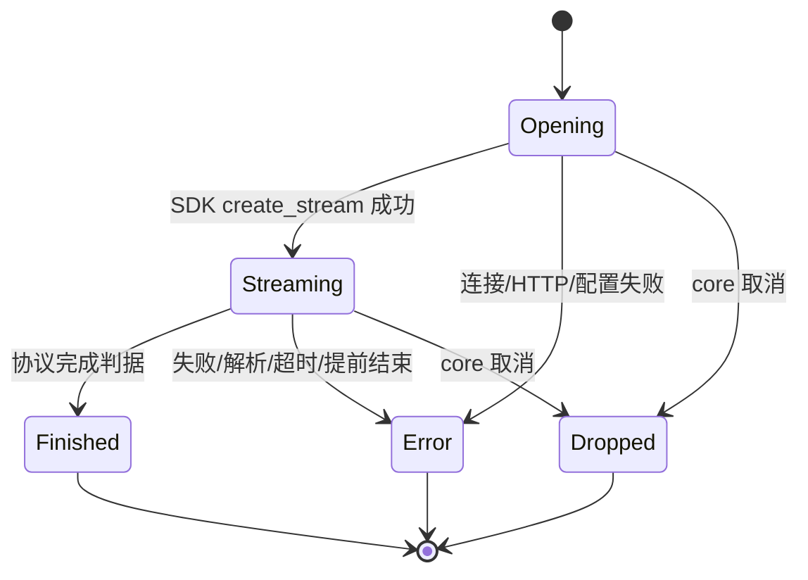
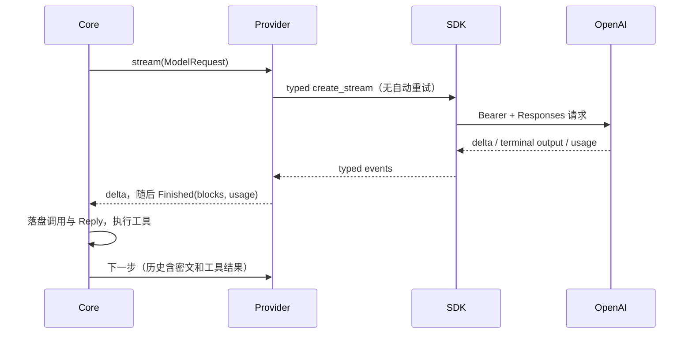
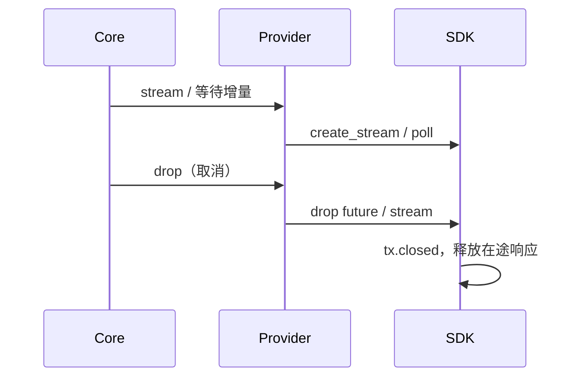

# B2: 模型调用统一迁移 async-openai，接入 Responses 与 ChatGPT 订阅

**状态**：DRAFT，待 human 批准（2026-10-10）；批准前不改实现与 Cargo 依赖。
**方向来源**：human 明确选择 async-openai，完整替换手写模型调用，删除防御性与兼容性绕行；保留 micnext agent 循环，吸收 Responses 的推理连续性、结构化输出和用量；订阅先手动填 Access Token。
**替代范围**：[provider-openai](provider-openai.md) 的传输、协议类型与响应映射；[model-settings](model-settings.md) 的服务商/模型配置新增 Responses 分支；[provider-port](provider-port.md) 的公共事件与执行职责延续。

## 一、结果与职责

所有模型推理和服务商探测经 async-openai；不再保留手写 HTTP/SSE 主路径。Chat Completions 与 Responses 各自转换请求和结果，不按一个 bool 切协议，不把 core 扩成 SDK API。

- micnext：上下文窗口、系统提示、工具执行、重试、取消、历史与用量落盘、Web/Channel 事件。
- async-openai：标准协议类型、请求发送、鉴权头、SSE 分帧、JSON 解析、流生命周期。
- provider：配置边界、领域消息与 SDK 类型的转换、服务商真实扩展、结束语义与失败分类。

不接 app-server、不实现 OAuth/刷新、不读写 Codex 凭证文件。手动 Token 过期后明确报告账户问题，由用户替换。不存在订阅失败后改用 API key 计费的路径。

## 二、事实与影响边界

基线为实际下载的 async-openai **0.42.2** 源码，而不是搜索结果中较旧的版本。

1. SDK 支持 Chat Completions 和 Responses、工具调用、推理摘要/密文、用量、失败与不完整响应。[Responses API](https://docs.rs/async-openai/latest/async_openai/struct.Responses.html)
2. SDK 原生 Chat 类型未定义现用的 `reasoning_content`、Ollama `reasoning`、DeepSeek `prompt_cache_hit_tokens` / `prompt_cache_miss_tokens`。迁移时不能把这些当未知字段丢掉。使用 SDK BYOT 承载强类型扩展，仅扩展缺失字段，不重新复制标准协议。[SDK 项目说明](https://github.com/64bit/async-openai/blob/main/async-openai/README.md)
3. SDK 默认 HTTP executor 会重试；本项目必须安装不带重试层的 `ReqwestService`，避免与 core 三次尝试叠加。
4. SDK 丢弃消费者流时会通过 `tx.closed()` 结束读取任务，释放响应体；流使用 SDK 的内部队列，provider 不另加转发任务或队列。
5. SDK Chat 流吞掉 `[DONE]`，对调用方只暴露 EOF；完成判据需要明确修订，见 §六。
6. SDK `ApiErrorResponse` 有 HTTP 状态与结构化错误，但不保留 `Retry-After`；JSON 解析失败和 5xx 路径会直接记录原始响应。保留请求级 HTTP 元数据、限制 SDK 原始载荷日志是有消费者的必要适配，见 §七。
7. SDK 0.42.2 的 Responses `InputTokenDetails` **已有可选 `cache_write_tokens`**。先前讨论“缓存写入总是 None”以此次源码为准修正：上游提供就接收，未提供才为 None。

订阅的官方文档要求具有 ChatGPT plan 使用权限的 OAuth Token，使用公共 `/v1/responses`、`store=false`、`stream=true`。[官方请求说明](https://developers.openai.com/siwc/token-sharing-open-source/models-and-inference)
**从现有 Codex 登录缓存提取的 Token 是否具有这一权限仍未验收。** 本蓝图不把“Bearer 格式相同”当成权限证明；实跑失败时记录错误分类和脱敏错误码，交回 human，不自动切换私有 backend-api。

## 三、模块与依赖

沿用 `mic-provider-openai` crate 与公开装配入口：

```rust
pub struct OpenAiModule; // Module::name() = "openai"，Activation::Always
```

新增的内部模块全部 `pub(crate)` 或私有：

| 模块 | 唯一职责 / 消费者 |
|---|---|
| `config` | 解析配置并生成协议专属强类型配置；工厂消费 |
| `client` | 构建 SDK client、无重试传输、请求级 HTTP 元数据；Chat/Responses/probe 消费 |
| `chat` | Chat 请求映射、增量累积、结束与用量映射；Provider 消费 |
| `responses` | Responses 请求映射、增量与完整输出映射；Provider 消费 |
| `extensions` | DeepSeek/Ollama 的 SDK 缺失字段；只由 Chat 消费 |
| `error` | SDK/HTTP/上游业务错误映射；两种协议与 probe 消费 |
| `probe` | 各服务商模型目录转换；工厂 `list_models` 消费 |
| `limits` | 本 crate 构建期旋钮 |

协议各自实现私有 `ChatProvider` / `ResponsesProvider`，都实现既有 `Provider`。两者共用传输和错误语义，不强行共用协议累积器。

新增外部依赖 `async-openai = "=0.42.2"`，只启用已核对的 `rustls`、`chat-completion`、`responses`、`byot`、`middleware`、`model`。`reqwest` 统一为 SDK 所需 0.13，供超时/连接构建和极薄 HTTP service 使用；删除本 crate 的直接 `eventsource-stream` 依赖。

内部依赖保持 `mic-core` + `mic-message` + `mic-store` + `mic-tool`，不新增跨 crate 依赖、不新增 crate。`mic-core`/L0 不依赖 SDK。`lib.rs` 仅公开 re-export `OpenAiModule`，工厂/安装实现移入私有模块。

## 四、公开契约与配置

### 4.1 Provider / 工厂

`Provider`、`ProviderFactory`、`ModelRequest`、`ModelEvent`、`ModelResponse`、`StopReason`、`ProviderError` 的签名与枚举保持不变，见 `crates/mic-core/src/provider.rs`。公开消息类型追加阶段与推理元数据，见 §4.3。不新增 runner、运行终态、Channel 或实时事件。

既有 `kind="openai"` 继续表示 Chat Completions；新增 `kind="openai-responses"`。`kind` 只在工厂注册边界选择实现，内部靠类型分离协议，不用 action 字符串分发。

### 4.2 服务商与模型配置

Chat 既有配置完整保留：`preset=generic|deepseek|ollama`、`base_url`、模型 `max_tokens`、DeepSeek `reasoning_effort=none|low|high|max`；地址与现有环境变量约定不变。这些是正在使用的产品契约，不是待删的兼容补丁。

Responses 服务商配置：

```json
{"preset":"openai"}
{"preset":"chatgpt"}
```

两者固定 `https://api.openai.com/v1`，不接受 `base_url`；`openai` 凭据为 API key，未保存时读 `OPENAI_API_KEY`；`chatgpt` 凭据为手动 Access Token，未保存时**不读环境变量**，防止误用计费凭据。两者都要求凭据，缺失在 build/probe 边界返回配置/鉴权错误。

Responses 模型配置：

```json
{"max_output_tokens":null,"reasoning_effort":null}
```

`max_output_tokens` 是正整数或 null；`reasoning_effort` 为 SDK 定义的 `none|minimal|low|medium|high|xhigh|max` 或 null，使用 SDK 强类型解析。不猜模型能力、不按模型名补兼容规则；上游拒绝某档位 → Rejected。null 表示不发送该参数，不伪造统一默认值。

Web 服务商 config、模型 config 由 `kind` 区分的联合类型一次解码。去掉表单里写死 `kind="openai"` 的假设；不做通用 schema 表单引擎。Chat 与 Responses 的推理选项独立，max 参数按各自语义显示。

凭据复用现有加密 SQLite、`CredentialWrite` 的 Keep/Clear/Set 和只暴露 `key_set` 的 API。字段传输名称保持现有契约，网页标签按预设显示“API Key”或“Access Token”；Token 不进入 `config.toml`、明文日志、模型输出或诊断 SQL。

### 4.3 assistant 阶段元数据

Responses 的 assistant 输出可以带 `commentary` / `final_answer` 阶段，续轮回传需要保持。为已有正文块追加独立字段，不让文本承担元数据：

```rust
#[derive(Debug, Clone, Copy, PartialEq, Eq, Serialize, Deserialize)]
#[serde(rename_all = "snake_case")]
pub enum AssistantPhase { Commentary, FinalAnswer }

// ReplyBlock 的其它变体不变
Text { text: String, phase: Option<AssistantPhase> }
```

生产者：Responses 输出转换。直接消费者：Responses 历史输入转换；Web/微信呈现仍只消费 text。Chat 产出 `phase=None`，转换历史时只发文本。SDK phase enum 不出 provider 边界。

历史磁盘记录缺失 phase，在反序列化边界按显式 `#[serde(default)]` 解作 None：这是既有记录的字段演进，不保留旧 runner/协议路径、不猜 phase。新写记录统一包含 phase。Web 解码器相应接受新版字段；部署顺序后端与嵌入前端一起更新，不维护新旧前端双轨。

`Reasoning::Visible` 保持不变；`Redacted` 追加独立元数据，把同一 reasoning item 的摘要与密文放在一起，避免分别存为 Visible/Redacted 后无法确定关联：

```rust
Redacted {
    data: String,
    id: Option<String>,
    summary: Vec<String>,
}
```

生产者为 Responses reasoning item；续轮消费者用 id、summary、data 恢复 SDK 强类型 reasoning input，显示消费者只读取 summary，绝不显示 data。请求模型相同时回传；换模型不回传。历史缺失 id/summary 在磁盘边界显式默认 None/空数组，与 phase 同属记录字段演进；不把私有 JSON 包塞进 String，不把 id/data 塞进 signature。SDK 接收完整 reasoning item；暂无续轮消费者的 content/status 不新增领域状态。

## 五、输入输出与用量

### 5.1 Chat

标准字段使用 SDK 类型；DeepSeek/Ollama BYOT wrapper 只增加缺失字段，标准子结构复用 SDK。调用 SDK `chat().create_stream_byot`，SSE 分帧和 JSON 反序列化仍由 SDK 完成。DeepSeek 非标准 `insufficient_system_resource` 结束原因用显式扩展枚举接收，不把 finish_reason 留为任意字符串。

BYOT 不是裸 JSON 逃生口：请求、分片、usage 都是命名 struct/enum，禁止用 `serde_json::Value` 接整份响应或 usage 再索引字段。Value 仅保留现有 ToolSpec schema / 工具参数契约。SDK 标准 reasoning_tokens、cached_tokens 直接复用；只有服务商不同名字段新增定义。Ollama 当前走 OpenAI 兼容 `/v1/chat/completions`，原生 `/api/chat` 的 `message.thinking` 不混入本适配；实跑核对兼容端点的实际字段，若与现有 `reasoning` 契约不符，报告差异并修订，禁止同时猜多种字段名。

沿用当前真实功能：DeepSeek 工具续轮回传可见推理；Ollama 接收 `reasoning`；Generic 接收标准缓存/推理统计；文本/图片输入、工具结果文字和框架消息都经 `model_view()`。不发 legacy `functions`/`function_call`，不尝试多个字段名，不自动切协议。

标准流仍需累积文本与函数参数；SDK 只负责解析，没有替项目组装最终业务 Reply。参数边界只 parse 一次：JSON 对象作为工具输入，否则保留原文并交给既有 mic-tool 参数错误反馈。这是模型自纠路径，不作为防御性 fallback 删除。

### 5.2 Responses

- 系统提示 → `instructions`；历史 → typed input items；工具 → SDK function tools；使用 `strict=false`，不强迫现有工具 schema 变成 strict schema。
- `store=false`、`stream=true`，include 请求加密推理内容；不使用 `previous_response_id`、Conversations 或服务端持久历史，micnext 仍是一处历史真相。
- 输入图片沿用 core 已加载的原件，映射为 SDK image input；没有支持的文件内容明确 Rejected，不悄悄丢弃。
- 正文/推理摘要 delta → 现有 TextDelta/ReasoningDelta；工具参数 delta 不新增实时事件。
- 完整结果以终态 response 的 `output` 为唯一内容来源，按 item 顺序转为 ReplyBlock，不同时再把 delta 累积结果当第二份真相。
- assistant message 的正文与 phase 一起保存；refusal 转为可见正文，结束为 ContentFilter。仅启用自己的 function tools；收到未配置、不能转换的输出项 → Protocol，不忽略实际输出。
- function call 的 `call_id` → 现有 ToolCall.id，工具结果按这个 id 回传；SDK item id 不与 call_id 混用。
- 带密文的 reasoning item → 一个 Redacted（summary、id、data）；仅有摘要的 item → Visible。summary delta → ReasoningDelta；最终显示按块里的摘要取值。若同一输出 item 同时返回实际 reasoning content 与 summary，完整类型接收后以 summary 为展示来源，不将二者拼成同一推理正文。同请求模型且当前协议为 Responses 时回传密文。Chat 历史转换不发送 Responses 密文。摘要不能替代密文续轮。

用量转换在终态执行一次，随后走既有调用记录和统计：

| 领域字段 | Chat 标准 / 服务商扩展 | Responses |
|---|---|---|
| input_tokens | prompt_tokens | input_tokens |
| output_tokens | completion_tokens | output_tokens |
| cache_read_tokens | 标准 cached_tokens / DeepSeek prompt_cache_hit_tokens；Ollama 未报为 None | input_tokens_details.cached_tokens |
| cache_write_tokens | SDK/上游提供才接收 | input_tokens_details.cache_write_tokens |
| reasoning_tokens | completion_tokens_details.reasoning_tokens | output_tokens_details.reasoning_tokens |

Responses 缓存写入 SDK 类型是可选 i64，外部边界检查非负后转 u64；负数为 Protocol，不截断、不取绝对值。输入包含缓存部分，输出包含推理部分，不再加一次。total_tokens 和命中率是派生值，不新增数据库事实列；输入为 0 时命中率不定义。未提供 usage 为 None；提供 0 保留 0；失败调用用量仍遵循现有契约全空。

## 六、终态、实体与不变量

| 实体 | 写者 / 生命周期 |
|---|---|
| 配置快照 / SDK client 配置 | 工厂 build 一次，provider 只读，本轮绑定 |
| 单次请求 HTTP 元数据 | 单次调用的无重试 service 写，错误转换消费；不同调用不共享可变槽 |
| 上游响应流 | SDK 读取任务独占；provider drop 关闭消费者 |
| Chat 业务累积器 | provider stream 唯一写者 |
| Responses 最终 Reply | provider 依据终态 output 一次转换 |
| run / 工具 / SQLite 记录 | 原 core/store 写者，SDK 不参与 |



Chat：请求单候选，显式映射 SDK finish enum；得到 finish_reason 后继续消费到 SDK 流结束，以接收尾随 usage。无 finish_reason 的 EOF → Transient；已结束 choice 后的实际内容增量 → Protocol。**SDK 正常 EOF + 完整 finish_reason 替代原先必须观测 `[DONE]` 的判据**；库不暴露终止标记，不再手写 SSE 绕回旧路径。

Responses：completed → EndTurn 或 ToolUse；incomplete 且 max_output_tokens → MaxTokens，content_filter → ContentFilter，未知原因 → Protocol；failed/error → Err；没有终态的 EOF → Transient。incomplete 转 Finished 属于已有非完整回复终态语义，不冒充完成。收到终态立即停止并 drop SDK 流。





不变量：只有 core 重试；每次 stream 最多一个 Finished 或 Err；取消不合成额外终态；SDK 类型不越过 provider；配置一次边界解析，内部不重复 canonical/validate；未知外部语义报 Protocol；工具参数错误仍回给模型；Chat 与 Responses 共用全部运行事件/落盘/取消路径。

## 七、错误、超时和隐私

继续使用现有四类 ProviderError、ProbeError；ProbeError::Auth 文案统一“凭据无效或没有权限”，覆盖 API key 与 Token。

| 输入 | 领域结果 |
|---|---|
| 401/403、402、明确订阅额度不可用/耗尽错误码 | Account，不重试 |
| 429（普通速率限制）、5xx、网络/空闲超时/缺终态 | Transient |
| 其它合法 4xx / 明确请求参数错误 | Rejected |
| SDK JSON/type 解析失败、未知输出语义、不变量破坏 | Protocol |

HTTP 元数据由单次 SDK service 收到 Response 时记录 status 与 Retry-After（秒数形式），SDK 正常继续完成 body 解析。provider 错误转换据此分类，Retry-After 交回 core；不用全局 last_response、不缓存跨调用错误、不另写 HTTP 发送/响应体解析器。service 复用 SDK ReqwestService，包装只观测元数据，不重试、不创建常驻任务。

SDK 错误不能直接 `to_string()` 发往日志/UI：JSONDeserialize 携带原始内容；使用 variant 和有限的结构化 code/type/状态生成文案，凭据类用固定提示。禁用 SDK `async_openai::client` / `async_openai::error` 的原始载荷日志，必须对终端和 DeveloperLogs 两个 sink 生效且不能被 RUST_LOG 覆盖；其余项目诊断日志沿用现有系统。业务失败分类和请求模型名可审计，但不记录请求体/鉴权头。

保留 CONNECT_TIMEOUT=30s、STREAM_IDLE_TIMEOUT=300s、PROBE_TIMEOUT=15s；空闲超时包括 SDK 打开流和每次消费等待。drop 超时 future/stream 同时关闭上游。删除 ERROR_BODY_CHARS 和原文截取机制，不再把不可信响应体拼进错误文案。

## 八、删除审计与迁移

原模块不是冻结不动的黑盒；已查看 git log，现有代码来自 provider-port、服务商分层、图片输入等已验收功能。删除按职责迁移，不以行数变少为验收。

| 删除项 | 正确性去向 | 隐私 | 失败行为 | 可审计性 |
|---|---|---|---|---|
| 手写 HTTP connect / SSE 分帧 | SDK client 与 typed stream | 禁止原始载荷日志 | SDK error → 四类；保留超时 | 分类/模型/run 记录延续 |
| wire.rs 标准协议类型 | SDK 标准类型 | SDK 类型不进入库 | parse 一次，错误显式 | 版本固定，非标准字段有命名类型 |
| raw 错误体解析与截取 | SDK error + 请求级状态 | 删除 body 输出 | 不用正文猜错误，不静默 fallback | 状态/错误码足够定位 |
| started 等能由状态表示的布尔哨兵 | 协议专属阶段与枚举 | 无额外载荷 | 必要终态检查仍留在入站边界 | 状态转换明确 |
| 内部重复配置/内容合法性验证 | 配置边界与 core 不变量 | 沿用已加密凭据 | 配置错误 fail fast | ConfigError.field 延续 |
| 两套标准格式/字段猜测/legacy functions 路径 | 只接受选定协议 | 不扩出站范围 | 未支持语义明确拒绝 | 只有一个生产路径 |

不删实际 DeepSeek/Ollama 推理规则、外部输入解析、取消释放、失败分类、工具自纠和必要的流终态检查。它们分别承载领域功能与外部边界，不属于内部防御性检查。空回复不再靠“内容空所以猜服务异常”重试：合法终态允许空正文（例如仅有工具调用），违反协议才报错。

Parallel change 步骤，每步可编译可回滚；过渡不得双发请求：

1. 加 SDK、协议专属私有模块与新版 phase 字段，所有读者先能消费；生产流暂沿旧路径，冻结旧实现。
2. 既有 Chat 工厂一次切到 SDK，实跑 DeepSeek/Ollama/Generic 适用场景；通过后立即删除旧 provider/request/response/wire/probe 标准实现。
3. 登记 Responses 工厂与 Web 配置，打通 API key/订阅手填 Token。公共主路径不分叉。
4. 更新现行 provider-openai/model-settings/provider-port 文档为最终契约，删除临时入口和迁移开关；无 SDK→手写回退路径。

若步骤 1 发现无法复用 SDK 标准字段、无法保留现用功能或需要改更大消息契约，停手修订蓝图；不把不匹配当兼容补丁无限叠加。已发现核心/SDK 架构问题交回 human，不顺手重写 core。

## 九、全部调用方兼容性

| 调用方 | 判断 / 迁移 |
|---|---|
| `bin/micnext` 模块装配 | OpenAiModule 不变；只调整 SDK 原文日志过滤 |
| `bin/micnext` 一次性 -p / JSON 过程输出 | 运行路径不变，Reply 输出含可选 phase |
| `mic-core` Registry/Factories、服务商/模型 CRUD、本轮快照 | trait 不变，新 kind 由现有注册表识别；配置只由各工厂理解 |
| `mic-core/run.rs` 流消费、重试、落盘、工具执行 | ModelEvent/StopReason 不变；Text 构造/匹配按新字段编译迁移，不新增分支 |
| `mic-core/request.rs`、`recovery.rs` 工具 id 扫描 | ToolCall 不变，兼容 |
| `mic-message/model_view.rs` | 视图仍借用 ReplyBlock，新 phase 原样传递 |
| `mic-store` SQLite Message JSON、调用 Usage、凭据 | phase/id/summary 的旧记录在边界按显式字段默认值接收；表/Usage/加密格式不变 |
| `mic-gateway` 模型 CRUD/探测/历史/实时事件 | REST 路由与凭据操作不变；配置 payload 新联合分支，历史新增 phase；探测按服务商类型返回模型名 |
| `web/src/api/types.ts`、settings 表单/列表/decoder | 按 kind 一次解联合配置，新增 Responses 预设与 Token 标签，不按服务商名猜协议 |
| Web ReplyView / MessageList / DraftView | 正文/工具/推理显示沿用；phase 可接收且不改变可见文本；Redacted 只显示 summary，密文不显示 |
| 微信 `delivery.rs` / 其它文本读者 | Text 模式增加 `..`；投递正文不变 |
| mic-tool 与各工具 | ToolSpec / ToolCall.args 不变，参数解析与模型自纠延续 |

Chat 探测用 SDK 标准模型列表；ChatGPT plan 文档目录是 `models[]` / slug / visibility，并非平台 `data[]` / id，使用 typed BYOT 目录，不先试一种再 fallback。API key Responses 用 SDK 标准目录。目录成功只证明探测成功，完成一次真实推理才证明模型权限；Web 文案明确这一点。

## 十、验收与关闭

实现验收围绕功能，不新造架构测试；改动覆盖已有测试时才运行相应测试。HTTP/事件异常可用一次性本地 mock 手工验收，不留下额外运行模式。

1. Chat：DeepSeek 正文/推理/工具往返/缓存统计；Ollama 无 key 正文与思考；Generic 标准文本/图/工具与 usage。已有服务商与模型 ID、默认选择、加密 key 不变。
2. Responses：正文、工具往返、图片、推理摘要和密文续轮；phase 在下一请求保持；最终 output 顺序与落盘一致；Web 与 -p 共用主路径。
3. 连续两次相同前缀请求查看 input/output/cache_read/cache_write/reasoning；只断言接收与映射正确，不断言一定命中缓存。用量 UI、调用记录与终态 response 一致。
4. 失败：401/403、普通 429 与 Retry-After、订阅额度错误、5xx、非法 JSON、未知事件、缺终态、incomplete；确认 SDK 不暗中重试，core 尝试次数保持原契约。
5. 取消：等待首字节与空闲流两种时点取消，确认本地连接释放、没有后续落盘/工具执行。
6. 隐私：错误响应含伪造 Token/输入标记，确认终端、DeveloperLogs、UI 均没有原文；检查诊断 SQL 凭据仍不可读。
7. 手动订阅 Token：用户在网页输入有效 Token，不在聊天粘贴；完成一轮流式推理与工具续轮。若拒绝，记录分类/错误码，保持“待订阅验收”，不宣称已支持 Codex 缓存 Token。
8. `cargo fmt`、`cargo clippy -- -D warnings`、Web `bun run check` / `bun run build`、`cargo tree`。通过后删除旧生产者与路径、更新 todo；真实订阅推理未通过前不标 CLOSED。

本轮仅文档，无实现、依赖变更或联网推理；未读取任何真实凭据。
