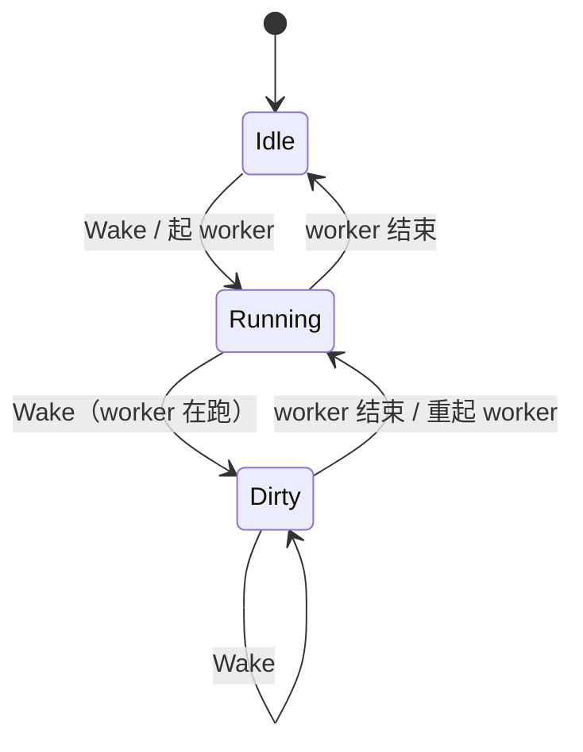
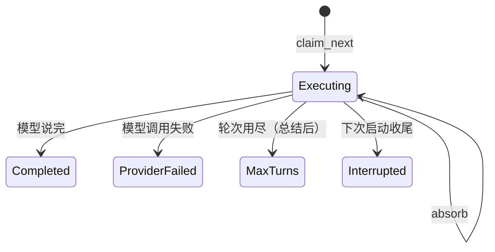
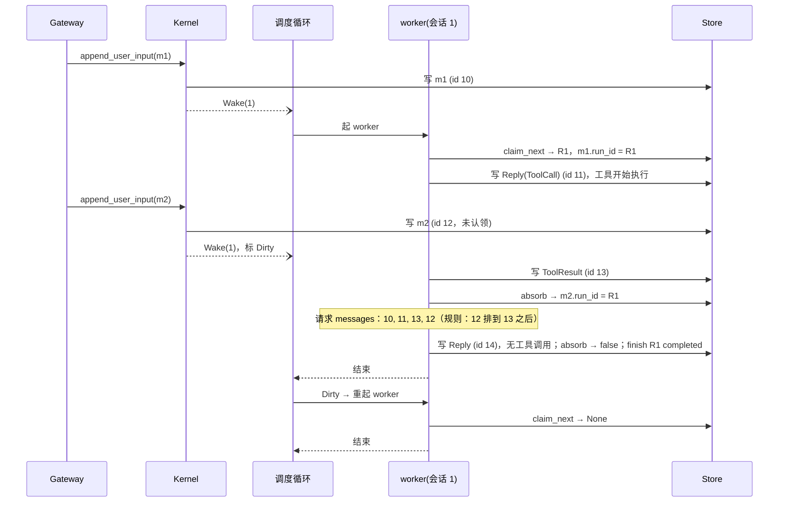
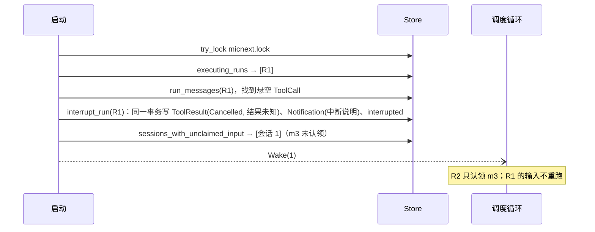

# B2: 执行主路径（调度、Agent 循环、落盘、崩溃收尾、实时事件）+ `-p`

**状态**: CLOSED（2026-09-23 批准并实现于 `crates/mic-core`、`crates/mic-store`、`bin/micnext`；§九验收 1～9 通过）；实现中追加的两处修订（bin 依赖、`ExecFailureKind::as_str`）已确认；2026-09-24 按 [`storage-restructure.md`](storage-restructure.md) 由 Query 改为 run（原 `query-execution.md`），其 §四 验收通过；2026-10-08 按 [`runtime-settings.md`](runtime-settings.md) 改：`max_turns` 与提示词人设/偏好来自 run 认领时的 `RunSettings`，`[core] max_turns` 移到网页设置
**来源**: [`v0a-module-map.md`](v0a-module-map.md) M6、M11 的 `-p`；[`next-gen-architecture.md`](../brainstorm/next-gen-architecture.md)
§4.4～4.7、§五（写者与不变量 I1～I4）；[`product-roadmap.md`](../brainstorm/product-roadmap.md) §2.4、§2.5、§四-7/8/10；
[`mic-store.md`](mic-store.md)（认领、run 状态）；[`provider-port.md`](provider-port.md)；[`mic-tool.md`](mic-tool.md)
**依赖不变量**: 全部在 `mic-core`，依赖 `mic-message` + `mic-store` + `mic-tool`；`mic-core` 不新增跨 crate 依赖，装配根 `bin/micnext` 为 `-p` 呈现新增直连 `mic-message`、`mic-store`（§七）。
本文同时修订 `mic-core` 装配（§3.3、§3.4、§五）与 `bin/micnext`（§六），合成一份；用到的 store 方法见 mic-store §4.2。

本文只写现行契约；修订过程见 git 历史。

## 一、用户视角的效果

- 发一条消息 → 模型边想边说（推理、正文增量实时可见），需要时调用工具，工具结果回给模型，直到说完。
  每次模型调用的完整输出（推理、正文、工具调用）与每个工具结果都落盘，刷新或断线后按历史回放。
- **执行中随时可以再发消息**（补充、纠正、叫停都一样）：不打断模型当前这次输出，也不打断正在跑的工具；
  等这次输出结束、本批工具结果全部回来，下一次调用模型时就带上它，由模型自己决定怎么接。
  从模型看，只是历史里多了一条 user 消息。
- 同一次回复里的多个工具调用并行执行。不同会话并行，互不等待。
- 一轮做得太久：接近轮次上限时框架提醒模型收尾；到上限时收回工具、让模型做最后一次总结告诉用户。
- 异常看得见：模型调用失败（重试后仍失败）、回复被截断、进程重启打断执行 → 会话里出现一条框架通知，
  由会话所属 Channel 投递给用户，下一轮模型也能看到。
- 进程崩溃或重启：正在执行的那轮收尾为"中断"，其中未完成的工具调用标为"结果未知"，**不自动重做**；
  重启前已发出、尚未开始执行的消息会自动执行。
- `micnext -p "列出当前目录"`：调试入口。不挂 Web/微信，在当前目录新建会话跑完这一轮即退出。
  常驻进程占用同一数据目录时拒绝启动。

## 二、范围

本文定：调度（认领、并入新输入、唤醒）、一个 run 的 Agent 循环、请求组装（system prompt、上下文顺序、工具）、
轮次预算、模型调用重试、落盘粒度、失败呈现、崩溃收尾、实时事件、数据目录独占、`Kernel` 新增方法、`-p`。

不定（各自 B2）：
- 打断正在进行的输出或工具调用（当前一律等待，见 §十）。
- `/clear`、压缩、Skill、ContextContributor、Hook（v1+）。本文的上下文组装只读 `context_window`，
  压缩 summary 由 v1 产生。
- 异步工具（`Dispatched`/`Completion` 的生产者，v2）。本文的调度与上下文规则已按"`Completion` 可认领、
  映射为 user 视图"处理，届时不改主路径。
- Gateway 读稳定历史（回放、会话列表、用量）的方法：随 M9 B2 与其消费者一起加入。
- Web 会话的 `pwd` 取值（M9）。

## 三、公开类型与签名

### 3.1 实时事件（`mic-core`）

```rust
/// 内核实时事件。可丢：订阅方落后即收到 `Lagged`，应断开并按稳定游标重放（v0a-module-map §二）。
#[derive(Debug, Clone)]
pub struct KernelEvent {
    pub session_id: SessionId,
    /// 会话所属 Channel（Root 的 `channel`），订阅方据此过滤，无需自己查会话。
    pub channel: String,
    pub kind: KernelEventKind,
}

#[derive(Debug, Clone)]
pub enum KernelEventKind {
    /// 一轮开始（已认领）。
    RunStarted { run_id: RunId },
    /// 当前草稿的正文增量。
    TextDelta(String),
    /// 当前草稿的可见推理增量。
    ReasoningDelta(String),
    /// 本次调用尝试没有产生 `Reply`（失败、重试前、或成功但无内容），草稿作废。
    DraftDiscarded,
    /// 任一消息落盘（用户输入、`Reply`、工具结果、HarnessNote、框架通知），带 id；
    /// 同一订阅内按 id 升序到达。成功调用的 `Reply` 即当前草稿的终点。
    MessageAppended(Message),
    /// 一轮结束，`state` 为落盘的终态。
    RunFinished { run_id: RunId, state: RunState },
}

pub struct EventReceiver { /* broadcast::Receiver<KernelEvent> */ }
impl EventReceiver {
    pub async fn recv(&mut self) -> Result<KernelEvent, Lagged>;
}

#[derive(Debug, thiserror::Error)]
#[error("事件订阅落后，丢失了 {0} 条事件")]
pub struct Lagged(pub u64);
```

`channel` 由发事件的一侧填（worker 与 `append_user_input` 都已知会话），是"元数据归最早知道它的 emit 侧"。
v0a 只有 Root 会话；子会话（v1+）取其根会话的 Channel。

**发布顺序**：所有发 `MessageAppended` 的写入（入站输入、run 产出、`Reply`）在内核里互斥，落盘与发布
在同一临界区内完成，故发布顺序即提交顺序。订阅方可把收到的最大消息 id 当完整前缀游标，重连不漏不重。
启动收尾（§4.6）在订阅者出现前运行，不发事件。

**草稿**：一次模型调用尝试的增量为一份草稿。同一会话同一时刻至多一份草稿（会话串行），所以增量不带 id。
每次尝试**恰好**以「`Reply` 的 `MessageAppended`」或「`DraftDiscarded`」之一结束，无论是否有过增量。

**增量与落盘消息的关联**（M9 过滤规则的依据）：订阅方把增量当临时显示，收到 `Reply` 的
`MessageAppended` 或 `DraftDiscarded` 就丢弃草稿、以落盘消息为准。Gateway 先订阅、后回放到消息 id N 时：
缓冲里 id ≤ N 的 `MessageAppended` 丢弃；缓冲里在一条已回放 `Reply`（或 `DraftDiscarded`）之前的增量丢弃。

工具开始与结束不单设事件：`Reply` 落盘后，其中还没有结果的 `ToolCall` 块都在执行中
（并行，§4.3），各自 `ToolResult` 的 `MessageAppended` 即结束。

### 3.2 `Kernel` 新增方法

```rust
impl Kernel {
    /// 配置声明的 owner person（§五）。单用户：Web 固定 token 与 `-p` 都以它身份写入。
    pub fn owner(&self) -> PersonId;
    /// 写入未认领的用户输入（时间戳由内核打）并唤醒该会话的调度（fire-and-forget，不等执行）。
    /// 写入即发 `MessageAppended`。会话正在执行时，新输入由当前 run 在下一个模型调用边界并入（§4.3）。
    /// 内核已停止时只写不唤醒，下次启动由 §4.6 补跑。
    pub async fn append_user_input(
        &self,
        session: SessionId,
        person: PersonId,
        parts: Vec<ContentPart>,
    ) -> Result<MessageId, KernelError>;
    /// 订阅之后产生的事件（全部会话，按 `channel`/`session_id` 字段过滤）。
    pub fn subscribe(&self) -> EventReceiver;
}
```

`append_user_input` 即 mic-core-module §三 占定的方法，按原语义落地。

### 3.3 `Assembly`（修订 mic-core-module §三）

```rust
impl Assembly {
    /// 常驻：独占数据目录、打开 Store、崩溃收尾、起调度与各 Service，直到 `stop` 或出错。
    pub async fn run(self, stop: CancellationToken) -> Result<(), RunError>;
    /// 一次性：同样的启动与收尾，但不起 Service、不补跑其它会话；新建 `cli` 会话写入 `prompt`，
    /// 跑完这一轮即返回。事件经 `on_event` 交给调用方呈现。
    pub async fn run_once(
        self,
        once: OneShot,
        on_event: impl FnMut(&KernelEvent) + Send,
        stop: CancellationToken,
    ) -> Result<OnceOutcome, RunError>;
}

pub struct OneShot {
    pub prompt: String,
    /// 会话工作目录，绝对路径（二进制取进程 cwd）。
    pub pwd: PathBuf,
}

pub enum OnceOutcome {
    Finished { session_id: SessionId, state: RunState },
    /// 收到 `stop` 时本轮未结束；该 run 留在 `Executing`，下次启动收尾为 `Interrupted`。
    Stopped { session_id: SessionId },
}
```

`-p` 会话：`SessionKind::Root { channel: "cli", chat: "<unix 毫秒>" }`、无投递目标、`ToolScope::All`、
person 为 owner。与 Web、微信会话同一条主路径，只有入口参数不同。

### 3.4 错误（修订 mic-core-module §六）

```rust
pub enum AssembleError {
    // …既有变体
    #[error("还没有指定要用的模型：在 [models] 下写 default = \"<条目名>\"，模型本身写在 [models.<条目名>]")]
    MissingDefaultModel,
}

pub enum RunError {
    // …既有变体
    #[error("数据目录 {path} 已被另一个 micnext 进程占用")]
    DataDirLocked { path: PathBuf },
    /// 执行路径里的 panic（core、工具或 Provider 的缺陷）：进程报错退出，重启后该轮收尾为 Interrupted。
    #[error("会话 {session_id:?} 的执行崩溃：{message}")]
    RunPanicked { session_id: SessionId, message: String },
}
```

`[core]` 取值非法（`owner` 含 `:`；仍写着已移走的 `max_turns`）走既有 `AssembleError::Core`。
执行路径的 `StoreError` 经既有 `RunError::Store` 让进程退出。`KernelError` 不变。

### 3.5 `Engine`（内部）

`Engine.model` 是 `[models] default` 的条目名，只用于日志；调用记录与推理回传用 `provider.model()`
（请求模型名，provider-port §3.2）。

## 四、规则

### 4.1 实体、写者与状态

| 实体 | 写者 | 说明 |
|---|---|---|
| `UserInput` | `Kernel::append_user_input`（Gateway、`-p`） | 写入即唤醒；`run_id` 为空 |
| run 创建（认领） | 会话 worker 调 `claim_next` | 同一会话至多一个 `executing`（store 保证） |
| 输入并入 | 会话 worker 调 `absorb` | 只并入自己持有的 `executing` run |
| 调用行 + `Reply` | 会话 worker 调 `record_model_call`，每次尝试一行 | 同一事务 |
| 工具结果、HarnessNote、框架通知 | 会话 worker 调 `append(session, Some(run), …)` | 只有持有 `executing` run 的 worker 写该会话的产出 |
| run 终态 | 会话 worker 调 `finish_run`；启动收尾调 `interrupt_run` | |
| 修补结果与中断通知 | 启动收尾（§4.6） | 此时没有 worker 在跑；挂在被收尾的 run 上 |
| 调度表（哪些会话有 worker） | 调度循环独占 | 内存状态，不落盘 |

调度表里每个会话的状态：



run：



v0a 没有用户取消的终态：叫停也是一条普通输入，由模型读到后自行收尾（Web 端停止按钮见 §十）。

### 4.2 调度

- 调度循环是一个内部任务，独占调度表，经 mpsc 收 `Wake(SessionId)`，也收各 worker 的结束通知（JoinSet）。
  `append_user_input` 只发 `Wake`，不等回执（CLAUDE.md 禁止自等待）。worker 不发 `Wake`。
- worker：`loop { claim_next → 没有则结束；执行一轮；finish_run }`。worker 结束与 `Wake` 都在调度循环里
  串行处理，"worker 刚确认没有新输入就结束、恰好此时来了新输入"由 `Dirty` 状态接住，不会漏。
- 会话在跑时来的 `Wake` 只把状态标 `Dirty`；新输入通常已被当前 run 用 `absorb` 并入，
  worker 重起后 `claim_next` 为空即结束，多一次空认领，无副作用。
- 跨会话并行，不设全局并发上限（next-gen §4.4）。
- worker panic（含工具任务 panic）→ 调度循环返回 `RunError::RunPanicked`，进程按 mic-core-module §五 退出。
  执行中的 `StoreError` 同样退出。重启后由 §4.6 收尾：不做进程内隔离与修补，只保留崩溃恢复这一条路。

### 4.3 一个 run 的循环

```
calls = 0
loop:
    absorb                                         # 并入已到达的新输入（模型调用边界）
    calls == max_turns →
        写 HarnessNote（轮次用尽：停止调用工具，总结进展与未完成事项并告诉用户）
        不带工具调模型一次 → 落盘；截断则通知；MaxTurns；结束
    calls == warn_at 且本轮未提醒过 → 写 HarnessNote（已用 calls/max_turns 次，尽快收尾）
    组请求（§4.4）→ 调模型（§4.5），calls += 1
        失败 → 通知 + ProviderFailed；结束
    record_model_call(Replied)：调用行 + Reply（blocks 非空时）同一事务
        有 Reply → 发 MessageAppended(Reply)；否则发 DraftDiscarded
    stop 为 MaxTokens / ContentFilter → 通知
    Reply 里有 ToolCall → 并行执行本次全部调用，各自完成即落盘结果；全部结束后 continue
    absorb 有新输入 → continue
    Completed；结束
```

- `warn_at = max_turns × MAX_TURNS_WARN_PERCENT / 100`（向下取整，至少 1；等于 `max_turns` 时不单独提醒）。
- `max_turns` 取自本轮 `RunSettings`（认领时定下，执行中不变），计的是带工具的模型调用次数；重试不计；用尽后的总结调用额外一次。
- 有无工具调用只看 `blocks` 里是否有 `ToolCall`，不看 `stop`：被截断的回复如果带了工具调用，
  照常执行（参数不完整的由 mic-tool 边界报 `input`，模型自行纠正）。
- 并入发生在模型调用之前，所以用户在模型输出或工具执行期间发的消息不会打断它们，只在下一次调用时被看到。
  模型本打算结束（无工具调用）但期间有新输入，本轮继续而不是结束后另起一轮。
- **工具并行**：本次回复的全部 `ToolCall` 同时开始（tokio `JoinSet`，工具句柄以 `Arc` 共享），
  结果按完成先后落盘。任务集合被丢弃时（停止）各工具 future 随之取消。由模型保证同一回复内的调用互不依赖。
- 工具调用 → 结果：
  - 名字不在本会话可用工具里（未登记，或不在 `tool_scope`）→ `Failed{Input, "unknown tool `x`"}`。
  - 否则 `ToolHandle::invoke(args, ToolContext::new(session.pwd))`：`Ok(parts)` → `Completed{output}`，
    `Err(e)` → `Failed{e.kind, e.message}`。
  - 一律包成 `ToolResult{tool_name, tool_call_id, Terminal(..)}`。
- HarnessNote 以 `append` 落盘（`MessageBody::HarnessNote`），模型视图为 `[runtime-note]` user 消息；
  排在本批工具结果之后（§4.4 规则 2 也保证这一点）。
- 每次请求前重读 `context_window`：历史以 Store 为唯一真相，循环不在内存里另存一份。

### 4.4 请求组装

- **模型**：`[models] default` 对应的 Provider，启动时确定；改模型 = 改配置重启（v0a-module-map §二）。
- **工具**：全部已登记工具按登记顺序（mic-tool §3.5），按会话 `tool_scope` 过滤，取 `spec()`；
  轮次用尽后的总结调用传空。
- **system prompt**（顺序固定，保证同一会话前缀稳定）：
  1. 基础提示（core 内常量，英文，见附录 A）；
  2. 本轮人设提示词（`RunSettings`，runtime-settings §五）；
  3. 通用偏好非空时：`User preferences:\n<文本>`；
  4. 环境：`Working directory: <session.pwd>`；
  5. 本次可用工具的 `prompt_hint()`，按工具顺序各占一段；
  6. `context_window.summary` 有值时附在最后（v0a 不会有）。
- **messages**：从 `context_window.messages` 按 id 升序生成。未认领输入已由 store 排除（mic-store §4.4
  不变量 3），吸收之后才到达的那部分留给下一个边界。一条规则：
  - **有工具调用在等结果时，user 视图消息往后放**：按 id 扫描，碰到 `Reply` 把其 `ToolCall` 块记为未结，
    碰到对应的 `ToolResult` 销账。有未结调用时遇到 user 视图消息（用户输入、`HarnessNote`、`Notification`、
    `Completion`），先放进待放队列，销账清零时按原顺序放回。于是请求里一次回复的全部 `ToolCall`
    之后紧跟全部 `ToolResult`，工具运行期间到达的消息落在结果之后，符合"同步工具要等"。
    异步工具（v2）的 `Dispatched` 回执本身就是 ToolResult，会立即销账；真实结果以 `Completion`
    作为 user 视图消息另行交付，同样适用本规则。
  - 存储层不受影响：落盘顺序与消息 id 就是真实发生顺序，回放照此呈现。规则只在 core 组请求这一处执行，
    Provider 按收到的顺序映射。

### 4.5 模型调用与重试

- 每次尝试：`provider.stream(req)`，把 `TextDelta`/`ReasoningDelta` 转发为事件，收到 `Finished` 即成功。
- `Transient` → 重试，总尝试次数至多 `MAX_MODEL_ATTEMPTS`（3）。等待时长取 `retry_after`，没有则
  指数退避（2 s、4 s），上限 `MAX_RETRY_WAIT`（60 s）。
- `Account`、`Rejected`、`Protocol` → 不重试。
- 每次尝试都 `record_model_call`，`model` 为 `provider.model()`：成功记 `Replied{usage, blocks}`
  （上游没报的用量为空）；失败记 `Failed{error}`，用量全空。
- 每次尝试恰好以 `Reply` 的 `MessageAppended` 或 `DraftDiscarded` 结束（§3.1）；成功但 `blocks` 为空
  只写调用行、发 `DraftDiscarded`，截断通知照发。
- 流中断后已显示的增量不落盘；只落盘成功的那次 `Finished`（provider-port "增量以 Finished 为准"）。

### 4.6 崩溃收尾与启动补跑

启动时（`run` 与 `run_once` 都做），在任何 worker 起来之前：

1. 独占数据目录：`<data_dir>/micnext.lock` 用 `File::try_lock` 加排他锁，持有到进程退出；
   拿不到 → `RunError::DataDirLocked`。这保证下一步不会把另一个活进程正在跑的 run 当成遗留。
2. `executing_runs`：遗留的 `executing` run。
3. 对每个遗留 run R，core 算出收尾消息，`interrupt_run` 在一个事务里写入并转为 `interrupted`：
   - `run_messages(R)` 里 `Reply` 的 `ToolCall` 块减去已有 `ToolResult`，差集各补一条（挂 R）
     `ToolResult{Terminal(Cancelled{"micnext stopped before this tool call finished; its side effects are unknown."})}`（I1）；
   - 追加一条中断通知（§4.7，挂 R）。
   - 不重跑（I4）：该 run 已认领的输入视为已消费。
   - 收尾中途失败或停止：未提交的 run 仍是 `executing`，下次启动从头收尾，不会留下悬空调用。
4. 仅 `run`：对 `sessions_with_unclaimed_input()` 的每个会话发 `Wake`。这些输入从未进入执行，补跑没有
   重复副作用。`run_once` 不补跑别的会话（它跑完自己那一轮就退出，不能留下半途的执行）。

正常停止（Ctrl-C/SIGTERM）不单独收尾：丢弃所有 worker（工具 future 随之取消，`bash` 杀进程组），
执行中的 run 留在 `executing`，下次启动按上面收尾。停止、崩溃、panic 走同一条恢复路径。

### 4.7 框架通知

面向用户的异常以 `Notification{source: "micnext", text}` 落盘：由会话所属 Channel 投递（Web 即时可见；
微信随其模块），也进入模型下一轮视图（`[notification src=micnext]`）。文案用中文、先说原因再说怎么办：

| 情况 | run 终态 | 通知要点 |
|---|---|---|
| 模型调用失败（不重试或重试用尽） | `ProviderFailed`（详情在调用行 `error`） | `ProviderError` 的中文说明；可重试的注明已试 N 次 |
| 回复被截断（`MaxTokens`） | 不影响（照常继续或 `Completed`） | 回复达到输出长度上限，内容不完整 |
| 被内容审核截断（`ContentFilter`） | 同上 | 回复被上游内容审核截断 |
| 重启打断（§4.6） | `Interrupted` | 上次执行因 micnext 停止而中断，未完成的工具结果未知，需要时请重新发送 |

轮次提醒与用尽写的是 `HarnessNote`（给模型看），不是通知；用尽后由模型自己的总结告诉用户，run 记 `MaxTurns` 供事后统计（如接 langfuse）。

### 4.8 落盘粒度与事件顺序

- 模型回复在 `Finished` 后与调用行同一事务落盘为一条 `Reply`；工具结果每个执行完即落盘。每次落盘紧接着发
  `MessageAppended`。
- 一轮的事件顺序：`RunStarted` →（[HarnessNote] → 草稿增量… → `Reply` 或 `DraftDiscarded` →
  [通知] → 工具结果…）×N → `RunFinished`。其间随时可能插入其它输入的 `MessageAppended`。
- 事件总线：`tokio::sync::broadcast`，容量 `EVENT_CAPACITY`（1024）。没有订阅者时发送即丢弃。

### 4.9 不变量

- **I1**：请求里一次回复的 `ToolCall` 之后紧跟其全部 `ToolResult`。运行中由"本批结果全部落盘才发下一次请求"
  加 §4.4 规则 2 保证；崩溃留下的悬空调用由 §4.6 补齐后才会有下一轮。
- **I2**：同一会话至多一个 `executing` run（store）且至多一个 worker（调度表）。
- **I4**：遗留执行只收尾、不重放；只补跑从未认领的输入。
- **一个 run 一个 person**：`claim_next` 与 `absorb` 都只取未认领输入开头同一 person 的一段。
- **单写者**：一个会话的产出只由持有其 `executing` run 的 worker 写，启动收尾时没有 worker。
- **数据目录独占**：同一时刻只有一个进程执行 §4.6（文件锁）。

### 4.10 关键场景

**执行中用户又发一条消息**



**执行中进程被杀，重启**



## 五、配置（修订 mic-core-module §四）

```toml
[core]
owner = "dzmfg"   # 可省略，缺省 "dzmfg"；不得含 ":"（mic-store §4.3）

[models]
default = "ds"    # 必填
```

- `[core] owner`：启动时 `ensure_person(owner)`，结果即 `Kernel::owner()`。
- `max_turns`：移到网页 设置 → 对话偏好（runtime-settings），run 认领时定下；配置里还写着 → 启动报错指明删除。提醒比例是构建期旋钮。
- `[models] default` 改为必填：缺失 → `AssembleError::MissingDefaultModel`（mic-core-module §四 已预告由 M6 改）。
- 默认配置模板写出 `[core] owner`，并取消 `[models]` 与 `[models.ds]`（DeepSeek 预设）的注释：
  首次运行只要设了 `DEEPSEEK_API_KEY` 就能直接用；没设则启动时由 provider-openai 报 key 缺失。
- 构建期旋钮进 `crates/mic-core/src/limits.rs`：`MAX_TURNS_WARN_PERCENT` 80、`MAX_MODEL_ATTEMPTS` 3、
  `RETRY_BASE` 2 s、`MAX_RETRY_WAIT` 60 s、`EVENT_CAPACITY` 1024、`WAKE_CHANNEL_CAPACITY`（有界 mpsc）256。

## 六、二进制入口（修订 mic-core-module §七）

```
micnext [--config <path>]                 常驻
micnext [--config <path>] -p <prompt>     一次性（调试用）
```

- 两个选项顺序任意；重复或多余参数 → 用法错误。`-p` 的 prompt 为空 → 用法错误。
- `-p` 呈现（`on_event`）：
  - `TextDelta` → stdout，原样输出；
  - `ReasoningDelta` → stderr；
  - `Reply` → 其中每个 `ToolCall` 块 stderr 一行 `▶ <name> <args JSON，超过 200 字截断>`；
  - `ToolResult` → stderr 一行 `◀ <tool_name> ok|failed kind=…|cancelled`，后接输出首行（截断）；
  - `HarnessNote`、`Notification` → stderr 全文；
  - 开始时 stderr 打印会话 id 与 run id。
- 退出码：`Finished` 且 `Completed` → 0；`Finished` 且其它终态 → 1；`Stopped` → 130；装配或运行错误 → 1。
- 日志照旧走 stderr 的 tracing；`-p` 下默认级别调为 `warn`，免得和过程输出混在一起（`RUST_LOG` 仍可覆盖）。

## 七、副作用与依赖

- 副作用：Store 写（消息、run、调用行、owner person）、模型网络请求、工具执行、数据目录锁文件。
- `mic-core` 依赖不变；`tokio` 增加 feature `sync`、`time`、`rt`（JoinSet）。从 `BoxStream` 取下一项用
  `std::future::poll_fn` + `Stream::poll_next`，不引入 `futures-util`。
- `bin/micnext`：新增 path 依赖 `mic-message`、`mic-store`（`-p` 呈现要匹配消息与 run 终态类型）；装配根本可依赖任意 crate，不涉及依赖不变量。
- `mic-message`：新增 `ExecFailureKind::as_str()`（契约见 [mic-tool](mic-tool.md) §三.1），模型视图的 `[failed kind=…]` 头与 `-p` 的 `◀` 行共用这一处小写标签。

## 八、调用方

| 调用方 | 用途 |
|---|---|
| `bin/micnext` | `run` 常驻；`-p` 调 `run_once` 并呈现事件 |
| `mic-gateway`（M9，待起草） | 用 `subscribe`、`append_user_input`、`owner`；读接口随 M9 加 |

## 九、验收

1. `micnext -p "列出当前目录"`：stdout 逐字流出回复，stderr 出现 `▶`/`◀` 行，退出码 0；
   用 `sqlite3` 查：`UserInput` → `Reply`（含 ToolCall）→ `ToolResult` → `Reply`，全部挂同一 run，
   run `completed`，`core_model_calls` 每次调用一行（`model` 为请求模型名，上游没报的用量为空）。
2. 让它同时读两个文件：同一 `Reply` 内两个 `ToolCall`，两个 `◀` 几乎同时出现。
3. 读一个不存在的文件：`◀ read failed kind=input`，模型据此纠正。
4. 设置页把单轮调用上限改为 2 并给一个需要多步的任务：出现提醒与用尽 HarnessNote，最后一次请求不带工具，
   模型输出总结，run `max_turns`，退出码 1。
5. 错误的 key：run `provider_failed`，stderr 出现中文通知，退出码 1，调用行 `error` 有值、用量全空，没有重试。
6. `-p` 让它跑 `sleep 60` 时 `kill -9`；再跑一次 `-p "hi"`：上一个 run 为 `interrupted`，
   悬空 ToolCall 已补 `cancelled` 结果并有中断通知；第二次正常完成。
7. 常驻进程运行时再起 `-p`（同一数据目录）→ 报数据目录被占用。
8. 执行中插话（并入与请求顺序）的端到端验证随 M9（Web）做。
9. 配置里删掉 `[models] default` → 启动报 `MissingDefaultModel`，二进制附上默认模板里的模型段作示例。

## 十、已知演进

- **停止按钮（Web）**：Web 端可提供按钮，立即取消当前模型流或工具并收尾为新的用户取消终态；
  微信等纯文本 Channel 没有这个入口，仍靠发消息让模型自行收尾。随 M9 之后单独 B2。
- **工具并发声明**：若同一回复内并行调用确实出现冲突（如并行写同一文件），再给工具加并发安全声明，
  有副作用的串行。
- **异步工具（v2）**：`Dispatched` 回执与 `Completion` 回注，调度与上下文规则已兼容（§4.4）。
- **tool 隔离**：若工具 panic 实际频繁导致进程重启，再把 panic 转 `Failed{Dependency}`。
- **多模型、按次切换**：`[models] default` 之外的选择随路由 B2。

## 附录 A：基础系统提示

全文只在 `crates/mic-core/src/prompts/system.md` 维护，此处不复制。

语气与篇幅归人设（runtime-settings 附录 A），基础提示不再带 "Be concise."。
