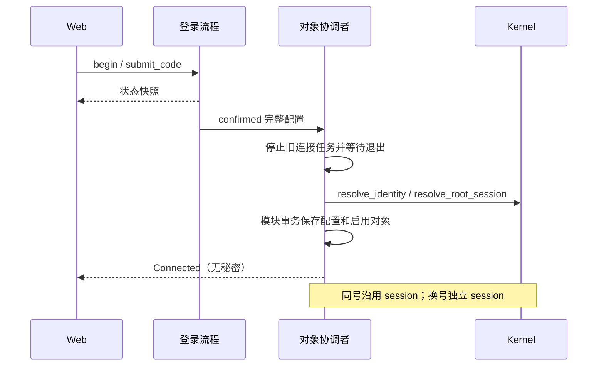
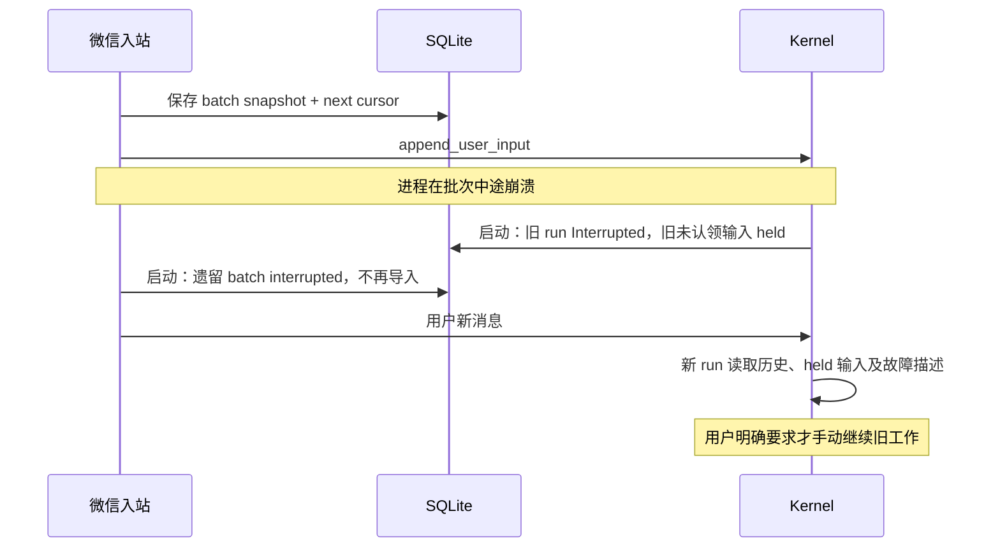

# B2：微信 Channel（v0b）

**状态：CLOSED（2026-10-10）：Phase 1–6 均已实现并经服务器人工验收（扫码、收发、typing）。后续能力见 [V2 B1](../brainstorm/wechat-v2.md)。**

本文是微信 Channel 的现行基础契约；V2 增量见 [引用 B2](wechat-quotes.md)、[入站图片 B2](wechat-inbound-images.md)。
协议事实见 [iLink 协议素材](../brainstorm/wechat-protocol.md)，依据官方包 `@tencent-weixin/openclaw-weixin@2.4.9`。

## 一、行为与范围

- Web 设置页扫码，完成后得到一份完整配置；凭据写 SQLite，不进入 config.toml，不返回浏览器。
- 一个微信对象对应一个扫码用户、一条 Root 会话。同一用户重新扫码只更新凭据，继续原会话。
  换用户启用另一对象；旧对象保留历史，旧号被顶、发送失败均可接受，不迁移积压。
- 本版只有一个启用对象。对象内部状态相互独立，为以后两个用户各运行一个 ClawBot 保留边界；
  本版不提供多对象管理界面、群聊或白名单管理。
- 入站接文本、服务端语音转写、图片（[入站图片 B2](wechat-inbound-images.md)）和文件/视频（[入站文件 B2](wechat-inbound-files.md)，存会话工作目录，消息带路径）；微信默认表情以 `[发呆]` 这类文本到达，SDK 无表情包类型。
  无转写语音为占位。
- 每条落盘 Reply 的全部文本块合并发送；Notification 同一路径。超长文本分段，不流式、不做 Markdown 转换。
- 微信发送首次失败后只重试一次，再失败则跳过并保留失败事实，后面的回复继续发送。
- 重启不自动重跑旧任务、不自动补发旧回复。新消息可启动新一轮，带已有上下文及故障描述。
  手动继续指用户明确发送新指令，例如“根据上次故障现场继续”；不恢复旧 run，也不自动重试未知副作用的工具。
- 自动压缩是正交的 core 功能，另起契约；本蓝图不增加微信专属压缩、上下文截断或 /clear。
- typing 尽力而为，不影响入站、执行和投递；ticket 按 SDK 缓存；run 期间每 5 秒续发，回复送达后才取消。

## 二、模块、依赖与装配

```text
mic-message ← mic-store ← mic-core ← mic-channel-wechat
mic-message ← mic-tool  ← mic-core ← mic-gateway
bin/micnext 装配以上模块；Gateway 与微信模块互不依赖。
```

新增 `crates/mic-channel-wechat`，公开 API 仅 `pub struct WechatModule;`。
`Module::name() = "wechat"`，`activation() = Always`；安装解析空配置、登记模块迁移、一个 Service 和一个登录 port。
若用户写入未知微信 TOML 字段，启动报错，不能静默忽略。

二进制新增 Cargo feature `wechat = ["dep:mic-channel-wechat"]`，默认启用；
`--no-default-features` 不登记该模块，Web 显示“本构建未包含微信”。feature 决定能力是否编入，SQLite 决定哪个对象启用。
`-p` 不启动任何 Service 或微信登录任务，仍走已有一次性执行路径。

内部依赖：微信仅依赖 `mic-core`、`mic-store`、`mic-message`；不依赖 Gateway、Provider 或工具实现。
外部依赖：tokio/tokio-util、reqwest（rustls、JSON）、serde/serde_json、thiserror、tracing、getrandom、base64（编码 X-WECHAT-UIN）。
二维码由 Web 使用本地打包的二维码库生成，不访问第三方二维码服务。
新增模块：core `channel_setup`、微信 `client/wire/login/account/service/delivery/limits`、Gateway `channels`；
lib.rs 只声明模块并 re-export 公开 API，其余类型默认 pub(crate)。

## 三、公开契约

### 3.1 core 的登录 port

port 只服务当前已观察到的扫码/验证码交互，不设计通用 Channel 配置框架。
二维码登录的协议细节由微信解析；Gateway 只呈现状态和提交用户输入。

```rust
// 以下均由 mic-core re-export。
#[derive(Clone, Debug, PartialEq, Eq, Serialize, Deserialize)]
#[serde(transparent)]
pub struct SetupAttemptId(pub String);

#[derive(Clone, Debug, Serialize)]
pub struct LinkedChannel {
    pub account_id: String,
    pub user_id: String,
    pub session_id: SessionId,
    pub connection: ChannelConnection,
}
#[derive(Clone, Debug, Serialize)]
#[serde(rename_all = "snake_case")]
pub enum ChannelConnection { Connected, NeedsLogin, Faulted }

#[derive(Clone, Debug, Serialize)]
#[serde(tag = "state", rename_all = "snake_case")]
pub enum SetupProgress {
    Preparing,
    Waiting { qr_content: String },
    Scanned { qr_content: String },
    NeedsCode { qr_content: String },
    Expired,
    Cancelled,
    Connected { account: LinkedChannel },
    Failed { reason: SetupFailure },
}
#[derive(Clone, Debug, Serialize)]
#[serde(rename_all = "snake_case")]
pub enum SetupFailure { Network, VerificationBlocked, ExistingBinding, Protocol }

#[derive(Clone, Debug, Serialize)]
pub struct SetupAttempt {
    pub id: SetupAttemptId,
    pub progress: SetupProgress,
}
#[derive(Clone, Debug, Serialize)]
pub struct ChannelSetupView {
    pub account: Option<LinkedChannel>,
    pub login: Option<SetupAttempt>,
}

pub trait ChannelSetup: Send + Sync + 'static {
    fn status(&self) -> BoxFuture<Result<ChannelSetupView, ChannelSetupError>>;
    fn begin(&self) -> BoxFuture<Result<SetupAttempt, ChannelSetupError>>;
    fn submit_code(&self, id: SetupAttemptId, code: String)
        -> BoxFuture<Result<(), ChannelSetupError>>;
    fn cancel(&self, id: SetupAttemptId)
        -> BoxFuture<Result<(), ChannelSetupError>>;
}

impl Registry {
    pub fn channel_setup(&mut self, setup: impl ChannelSetup);
}
impl Kernel {
    pub fn channel_setup(&self, channel: &str) -> Option<Arc<dyn ChannelSetup>>;
}
```

`BoxFuture` 复用现有 core 定义。登记键自动取 `Registry.current`，实现方不能另填一份名字。
重复登记返回新增 `AssembleError::DuplicateChannelSetup { channel: &'static str }`，启动失败。
Kernel 返回 trait 对象；未编入返回 None，未登录则 port 存在且 account=None。

微信另以 `wechat` 登记渠道提示（[channel-prompt](channel-prompt.md)）。模型随工具调用写的进度文字
复用 Reply 投递路径发出；core 不等送达再执行工具，不保证用户先于工具执行收到。

`ChannelSetupError` 是 thiserror 枚举：`AttemptNotFound`、`WrongPhase`、`InvalidCode`、`Unavailable`、
`Internal { source: BoxError }`。前四项为业务错误；Internal 的 source 只写经脱敏的本机日志。
验证码去首尾空白后非空、长度 ≤ 128 个字符；不猜数字位数。未知/旧 attempt id 拒绝，不送到新登录。

begin 创建新的 attempt，取消前一个未完成 attempt，立即返回 Preparing；后台自行推进扫码。
status 只读取快照，刷新、关页面或两个标签页均不推进协议轮询。
提交验证码只在 NeedsCode 有效；取消完成的 attempt 返回 WrongPhase。
过期通过 begin 重取，不自动无限重取。已完成结果保留到下一次 begin 或进程退出。

### 3.2 Kernel 的会话、身份与消息委托

```rust
impl Kernel {
    pub async fn resolve_identity(&self, identity: Identity, display_name: &str)
        -> Result<PersonId, KernelError>;
    pub async fn default_workdir(&self) -> Result<String, KernelError>;
    pub async fn pending_deliveries(&self, channel: &str)
        -> Result<Vec<PendingDelivery>, KernelError>;
    pub async fn mark_delivered(&self, id: MessageId) -> Result<(), KernelError>;
    pub async fn append_notification(&self, session: SessionId, source: &str, text: String)
        -> Result<MessageId, KernelError>;
    pub async fn subscribe_from_now(&self, session: SessionId)
        -> Result<(EventReceiver, Option<MessageId>), KernelError>;
}
```

identity 使用 Store 现有语义，Kernel 提供时间；微信 identity=("wechat", ilink_user_id)，
不同扫码人得到不同 PersonId，不将所有对象硬映射成 kernel.owner()。Web owner 不变；本版不增加多用户授权系统。
display_name 本版取 ilink_user_id，不虚构上游昵称。

default_workdir 从设置读取，展开 ~/ 并创建目录，返回 UTF-8 绝对路径。
这是现有 Gateway 私有 `new_session_workdir` 的共享下沉，两个消费者改用同一来源。
新增 `KernelError::Workdir(WorkdirError)`；公开 WorkdirError：`HomeMissing`、`NonUtf8 { path: PathBuf }`、
`Create { path: PathBuf, source: std::io::Error }`。不新增重复的配置校验。

pending_deliveries 是 Store 同名查询的薄委托；mark_delivered 同名委托并由 core 提供时间。
对象归属和失败跳过由微信解释，core 不识别微信 payload。
append_notification 使用既有 MessageBody::Notification，run=None，落盘后发布既有 MessageAppended，不唤醒模型。
它的当前消费者是不支持内容的提示；框架执行失败继续使用既有 Engine 通知，不绕到这个接口。
subscribe_from_now 与稳定消息发布共用 Events 的发布锁：锁内建立订阅并读取该 session 最新消息 id，
再释放锁。所有运行期稳定消息写入/发布均持有该锁，因此切点之后的新消息不会被算进历史前缀。
接收器仍是全局事件，消费者按 session 过滤；会话不存在返回新增 KernelError::SessionNotFound。
这个接口由微信 sender 消费，用来跳过旧积压而不漏掉初始化期间的新输出；原 subscribe 不变。

### 3.3 Store 的启动待命契约

```rust
impl Store {
    pub async fn hold_unclaimed_inputs(&self, at: i64) -> Result<Vec<Message>, StoreError>;
}
```

在既有 recovery 收尾 Executing 后、任何 Service/worker 启动前调用。
以事务将所有遗留未认领输入登记为 held，并为受影响会话追加一条既有 Notification，说明旧输入未执行、现场保留。
返回本次新增的通知，供启动日志计数；此时没有订阅者，不发实时事件。
通知只说明“上次有消息未执行”，不添加“现场保留”或“发送新指令”等自然行为说明。

新增 core 迁移表 `core_input_holds(message_id PRIMARY KEY REFERENCES core_messages(id), held_at NOT NULL)`。
held 是输入的调度处置，不是新 run 终态：claim_next、absorb、sessions_with_unclaimed_input 排除 held；
context_window 包含 held 输入，故新消息仍能带上旧现场。无模型调用、无假 Executing run、无设置快照伪造。
修改未认领输入的内部谓词时，调度与上下文各使用对应语义，不让“run_id=NULL”同时承载两个事实。

Assembly 不再用遗留输入预填 scheduler 的 initial 队列；运行期新输入仍经同一 wake、claim_next、Engine 路径。
旧 run 仍变 Interrupted，悬空工具仍补结果未知/取消说明。用户明确发新指令手动继续，仍创建新 run。
本轮不新增恢复按钮或恢复旧 run 的 API。

这是所有 Channel 的统一行为变更，覆盖 Web 和 CLI 遗留输入；不是微信专属开关。
`Message`、`RunState`、`KernelEventKind` 形状不变。held 表只被启动恢复、调度和上下文读取消费。

## 四、微信对象与持久数据

### 4.1 身份与凭据

对象键是扫码用户 `ilink_user_id`，内部强类型 `WechatUserId(String)`；公开视图 account_id 同样取它。
bot id、token、API baseurl 是对象可更新的连接配置，不作为会话主键。
Root 的 channel="wechat"、chat=ilink_user_id；同号 bot id 变化仍得到原 Session。
DeliveryTarget：channel="wechat"、version=1、payload 为强类型 `WechatTarget { user_id: WechatUserId }` 的 JSON。
磁盘版本非 1、payload 非法或与 session 归属不一致 → Err，不猜旧格式。

登录流程在 confirmed 边界一次构造私有 `WechatCredentials { user_id, bot_id, token, base_url }`。
四项缺失/为空或 base_url 不是无用户信息的 HTTPS URL → Protocol 失败，不落部分配置，不静默套默认 baseurl。
token 用私有包装，Debug 脱敏，不实现向 HTTP 视图序列化；登录结果不经过浏览器回传。

本 B2 提案将 bot token 放模块 SQLite 列，不增加第二套密钥管理；磁盘访问沿用既有本机 Store 边界。
API 不读出 token，日志不记录 token、context_token、验证码、二维码内容或原始响应正文；
例外：响应解码失败时，debug 级别输出原始响应体供协议对齐（可能含 token 与正文，仅调试时开启）。
已有模型 API key 的加密契约不变；若 human 要求微信 token 同样磁盘加密，应先修订本文凭据契约再实现。

### 4.2 模块迁移（module="wechat"，version=1）

| 表 | 字段与事实 | 写者/消费者 |
|---|---|---|
| wechat_account | user_id 主键、bot_id、bot_token、base_url、person_id、session_id、connection、updated_at | 对象协调者保存完整配置；收发 client 读取 |
| wechat_settings | 单行 active_user_id，可空，引用 account | 登录完成切换；Service 决定启用对象 |
| wechat_state | user_id 主键、get_updates_buf、context_token 可空、longpoll_timeout_ms | 本对象入站；发送/typing 读 token |
| wechat_inbound_batch | 本地 batch id、user_id、版本化强类型响应 snapshot、phase（importing/completed/interrupted）、created_at、finished_at | 入站与启动收尾；开发查看中断批次 |
| wechat_delivery | message_id 主键、user_id、版本化文本分段计划、最终 outcome（sending/sent/skipped/interrupted）、finished_at | 本对象唯一 sender；防止后续事件重新投递已跳过消息 |
| wechat_delivery_attempt | message_id、chunk_index、attempt_no（1/2）、client_id、started_at、finished_at、外部 message_id 可空、失败类别可空 | sender 写；本机审计读取 |

person_id/session_id/message_id 引用 core 对应主键，不由微信写 core 表。
所有 user_id 外键归属一致；模块表的版本与 payload 均在磁盘边界一次解析成强类型。
这里的 batch 是接收现场，不是按外部 message_id 建的去重表；不承诺服务端永不重复。
completed 批次可在成功导入后删除；interrupted 批次和发送失败记录保留，不自动清理。
删除 completed 批次的四项：消息已在 core、隐私边界不扩大、失败批次不删、失败审计仍在尝试表。

### 4.3 登录与切换的原子交接

本版只激活一个 user_id。扫码未完成不影响旧对象；登录失败不替换旧配置。
确认完成后取消并等待旧对象的网络任务退出，再保存新配置与 active_user_id，启动对应对象。
同号替换保留 person/session/history；首次创建按默认工作目录、默认人设/模型、ToolScope::All 建会话。
identity/session 创建后模块事务失败，最多留下无输入的空会话，沿用现有会话列表隐藏规则。

重新扫码后重置该对象的游标为空、context_token=None，不猜它们能跨凭据复用；原会话历史保留。
等待下一条有效入站取得新 token 后再发新回复；旧积压不自动补发。
每个在途请求持有所属对象及该连接代次。旧代次结果不能更新新连接；不将这种检查散落给 Gateway。
以后两个对象可各自运行同一对象流程，无全局投递锁；双对象的启用 UI 与协议限制届时另起 B2。

## 五、入站、重启与新一轮执行

1. getupdates 使用本对象的游标。仅长轮询超时视为“无新响应”，保持原游标；不制造成功响应。
2. 成功非空响应一次 parse 为强类型。先在模块事务保存完整 batch snapshot 与新游标，再逐条导入。
   空成功批次只更新游标/服务端 timeout。先提交游标明确选择至多一次导入，不保证崩溃窗口内每条都执行。
3. 只接本对象扫码人、无 group_id、message_type=User 的消息；其他身份/群/bot/未知 message_type 忽略，不回复。
4. 已准入消息先更新 context_token，再按 item_list 原顺序收集文本、voice.text 和图片，作为一次 UserInput 写入。
   不支持的媒体、无转写语音和失败图片按原位置打扁为文本占位，与处置说明经 `append_recorded_input` 同事务写入（见 conversation-parity.md）；
   含占位的入站只记录（held），不启动模型。
   单条消息内的缺陷只影响这一条，不断开入站连接（见 §6.2）。
5. 使用本对象 session/person 调 append_user_input，沿用全部既有事件、落盘、取消和执行行为。
6. 完成导入后标 batch completed。模块或 Store 不变量/写入错误 → Service Err，进程退出，保留 importing snapshot。

启动时 importing 批次转 interrupted，不重新调用 append_user_input；next cursor 已持久化，继续等待新消息。
已入 core 但未执行的旧输入被统一 held；已执行 run 被 recovery 收尾。
尚未导入的 batch 内容只作本机故障现场，不偷偷作为新指令提交；本版不为它造模型摘要。
崩溃后可能有部分输入未导入，用户手动重发即可。批次接收与 core 写入不宣称跨事务恰好一次。
服务端本身重复投递仍属已接受的无入站去重边界，启动待命不能证明上游无重复。

新消息入站后正常 wake 新一轮；模型读原历史、held 输入、中断通知及工具未知结果。
这个模型上下文与 Web 同源，微信不维护第二份上下文，也不自动认定旧工具可以安全重试。

## 六、出站、有限重试与 typing

### 6.1 一条消息的发送路径

sender 在对象接受新入站之前调用 subscribe_from_now，得到原子订阅切点；不把此前 pending 自动补发。
对象重新登录/启用也重新建立切点。落盘消息实时事件和 Lagged 补查只处理切点之后、归属本对象的 Reply/Notification。
Lagged 时重新查询 pending_deliveries 并按模块 outcome 排除已成功/跳过/中断的项，再按 id 顺序处理；
切点之后的消息不会因初始化期间查询而被误算成旧积压。

一条 Reply 只提取 Text 块，保持块顺序合并；不发送推理或工具参数。Notification 发送 text。
空文本直接标 delivered，不生成外部发送请求。超长按 Unicode 字符边界分段，分段计划先持久化。
每段首次发送之前登记 attempt 1；失败等待固定 2 秒后登记 attempt 2。每段最多两次请求，client_id 两次相同。
仅 ret 缺失或为 0 且返回有效 message_id 才成功；只表示服务端接受，不承诺手机已送达。

所有段成功后 mark_delivered，再将模块 outcome 标 sent；两步间崩溃不能重发，启动按 interrupted 留现场。
某段两次均失败 → outcome=skipped，后续段不发，继续下条 core 消息；先前已发送的段保留尝试事实。
skipped 不写 delivered_at；以后查询可能再次返回，但 sender 按模块 outcome 排除，不能无限重试。
sender 唯一且每对象串行，保证该对象尝试顺序；与入站长轮询和其他对象互不阻塞。

重启时所有 sending 与未结束 attempt 转 interrupted，不自动重试，不拿一次新进程预算再发两次。
发送返回成功但本地记录前崩溃的结果仍为未知，不能伪造成功，也不自动补发。
发送重试发生在活进程内；stop 可取消 HTTP 与 2 秒等待，剩余现场留到启动收尾。

### 6.2 登录失效与其他错误

- sendmessage 返回 -14 也是发送失败，仍完成仅一次重试；再失败则 skipped。
  当前两次预算完成后本对象 NeedsLogin，停止其后续收发；其他认证请求的 -14 立即走同一失效转换。
  不阻塞别的对象，重新登录仍不自动补发旧积压。
- 其他正常发送失败执行一次重试后跳过；Network/Timeout/Rejected 按强类型类别记录。
- getupdates 的网络错误按有限固定退避继续等待入站；正常长轮询超时直接重发。
  数据库、不变量、磁盘版本与边界解析错误 fail fast，不能伪装成空消息。
- Protocol 专指整个响应的结构、必需字段或已知枚举契约破坏；必须向 Service 返回 Err，不进入发送重试或静默跳过。
  结构合法的非零业务返回属于 Rejected，按正常发送失败处理。client 是这一分类的唯一来源。
- 入站单条消息的缺陷按条降级并打日志，不返回 Err：否则未 ack 的消息重启后再推，入站永久卡死。
  缺 context_token 或 message_id → 跳过该条（error）；未知 item type → `[不支持的消息]`（warn）；
  文本 item 无 text → `[不支持的消息]`（error）；引用无法解析 → `[引用失败]`（error）。
- 对外错误文案只包含类别和操作提示，不拼接含凭据的上游原文。

### 6.3 typing

本对象 RunStarted → 用缓存的 ticket（无或超过 `TYPING_TICKET_TTL` 才 getconfig，空 ticket 也缓存，同 SDK）→ sendtyping(1)；run 期间每 `TYPING_KEEPALIVE`（5 秒，SDK `keepaliveIntervalMs`）续发 sendtyping(1)。
尚无 context_token 或未下发 ticket → 本 run 不发 typing。
typing 为 Connection 的独立子任务，不阻塞投递；投递只发布已处理出站的前缀游标（watch，不等待）。typing 记下本 run 最后一条 Reply/Notification（先于 RunFinished 发布），RunFinished 后等游标追上它才 sendtyping(2)，手机上「输入中」与回复之间不留空档（2026-10-10 服务器实测：run 结束即取消时，回复约晚 0.35 秒到达）。
RunFinished 任意终态 → 使用该 run 的 ticket sendtyping(2)。正常网络/业务失败只记脱敏日志，不落 Notification，不重试。
明确 -14 优先执行连接失效转换，Protocol 优先返回 Service Err；不能被 typing 的尽力而为吞掉。
只处理本对象 session；Lagged 后用 executing_run 校准，取消已知 ticket 后按当前执行状态重新开始指示。
启动没有 active run 时不发 typing；恢复中的断网/进程退出无法保证手机立即取消，明确为尽力而为。
typing 不排在回复发送队列里，不因一个慢请求拖住入站或回复。

## 七、登录协议与 HTTP

登录流程自行持有二维码轮询、验证码和重定向状态；后台任务归微信 Service 管理，stop 时取消并等待退出。
多个 begin 仅最后未取消的 attempt 可保存配置。begin/submit/cancel 由 port 进入协调者，
内部完成结果用独立 task 完成通知；协调者不向自己的带 ack 命令通道发送并等待 ack。

confirmed 必须有完整凭据。binded_redirect 不发新凭据：本版返回 Failed(ExistingBinding)，
提示“已有绑定，请重新获取二维码登录”，不把缺配置或已失效配置视为成功；该分支接入实测后再核对。
scaned_but_redirect 必须有合法 redirect_host；轮询地址变更由 client 解析成 HTTPS URL。
need_verifycode 进入 NeedsCode；verify_code_blocked 进入 Failed(VerificationBlocked)；expired 进入 Expired。
网络失败仅在二维码有效期内继续等待，未知状态或字段不匹配返回 Protocol。

复用 Gateway Bearer 鉴权，不引入 cookie/CORS，所有接口同源：

| 方法与路径 | 请求 | 成功结果 |
|---|---|---|
| GET /api/channels/wechat | 无 | 200 ChannelSetupView；未编入返回 200 `{available:false}`，编入为 `{available:true, ...view}` |
| POST /api/channels/wechat/login | 空 JSON 对象 | 202 SetupAttempt，通常 Preparing |
| POST /api/channels/wechat/login/{id}/code | `{code:string}` | 204 |
| DELETE /api/channels/wechat/login/{id} | 无 | 204 |

HTTP DTO 是 Gateway 私有类型；available 是能力事实，不作为核心行为分支参数。
SetupProgress 用 serde 内部标签 state，类型定义即 wire 真相，Web TS 对齐。
错误均为 `{error:"中文说明"}`：未编入的写接口/AttemptNotFound → 404；WrongPhase → 409；
非法 JSON/未知请求字段/InvalidCode → 400；Unavailable → 503；Internal → 500（隐藏 source）；鉴权失败 → 401。
GET 只读状态，任何视图都无 bot token、context token、验证码或完整配置。
二维码过期/验证码封禁后 UI 提供“重新获取”；刷新页面读取现有 attempt，网页关闭不取消登录。
Web 继续只能查看微信历史，不能经原 messages/persona/model 写接口续聊微信会话。

## 八、协议边界与常量

client 完整接收源码所有已声明字段；暂无消费者的媒体、引用、工具 item 仍建强类型，不用 Value 漂流。
wire DTO 拒绝未知字段，新增上游字段先补边界模型，不在运行期静默丢掉。
所有响应的 ret/errcode 与 SDK 判定一致：缺失视为成功，出现非 0 为 BusinessRejected，-14 为登录失效
（实测 `getupdates` 成功响应不带 `ret`，`get_bot_qrcode` 带 SDK 未声明的 `"ret":0`）。
可选字段在 wire 层保留 Option；业务需要的 user_id、context_token、游标等在相应成功分支一次验证后交给内部流程。
取二维码以 HTTP 成功且两个必需字符串非空为成功；轮询以 HTTP 成功、已知 status 及该状态的必需字段为准；
confirmed 须完整凭据，未知字段/状态及缺失必需字段为 Protocol。

认证头/base_info 见协议素材 §二，协议值集中于 client/limits，不散落给 Gateway 或调用方。
bot_agent 为 micnext/<version>；iLink-App-Id=`bot`、bot_type=`3`、ClientVersion 取 2.4.9，服务器实测登录可用。

wire 接收字段清单（字段 optional 性保留源码声明，嵌套类型独立）：

| 类型 | 完整字段 |
|---|---|
| GetUpdatesResponse | ret, errcode, errmsg, msgs, sync_buf, get_updates_buf, longpolling_timeout_ms |
| WeixinMessage | seq, message_id, from_user_id, to_user_id, client_id, create_time_ms, update_time_ms, delete_time_ms, session_id, group_id, message_type, message_state, item_list, context_token, run_id, root_id†, parent_id† |
| MessageItem | type, create_time_ms, update_time_ms, is_completed, msg_id, ref_msg, text_item, image_item, voice_item, file_item, video_item, tool_call_start_item, tool_call_result_item, button_item_list†, at_bot_username_list† |
| RefMessage / PartialText | message_item, title, svr_id, partial_text / start, end, startindex, endindex, quotemd5 |
| CDNMedia / TextItem | encrypt_query_param, aes_key, encrypt_type, full_url / text |
| ImageItem | media, thumb_media, aeskey, url, mid_size, thumb_size, thumb_height, thumb_width, hd_size |
| VoiceItem | media, encode_type, bits_per_sample, sample_rate, playtime, text |
| FileItem / VideoItem | media, file_name, md5, len / media, video_size, play_length, video_md5, thumb_media, thumb_size, thumb_height, thumb_width |
| ToolCallStartItem / ToolCallResultItem | tool_name, tool_call_id / tool_name, tool_call_id, status |
| QRCodeResponse / QRStatusResponse | ret†, qrcode, qrcode_img_content / ret†, status, bot_token, ilink_bot_id, baseurl, ilink_user_id, redirect_host |
| SendMessageResponse / GetConfigResponse / SendTypingResponse | message_id, ret, errmsg / ret, errmsg, typing_ticket / ret, errmsg |

† 为 SDK 未声明、实测补收字段；button_item_list 元素字段未知，非空时按报错路径补模型。
message_id/root_id/parent_id 边界接受十进制字符串或整数，parse 为 u64，序列化为字符串；不经 f64。
msg_id/svr_id 为不透明字符串（实测如 `v1:…`）。
seq/尺寸/时长/索引使用无符号整数，时间毫秒使用 i64，ret/errcode 使用 i32；file.len 按源码接字符串。
message_type/item_type/state 等数字在 wire 层完整接收，进入领域时 parse 成已知枚举；
入站未知值按 §6.2 单条降级，不猜未知媒体为文本。RefMessage 递归使用 Box，按 serde 已有深度约束，不新增手写递归机制。

build 后不变的旋钮统一放微信 limits.rs：长轮询/二维码轮询超时 35s、二维码有效期 5min、
文本分段 4000 Unicode 字符、每段最多 2 次、发送重试等待 2s、入站网络错误退避 2s（连续 3 次后 30s）。
核心消息/输入 held 查询无需新增容量常量。Gateway 验证码长度限制放它的 limits.rs。

## 九、写者、状态与关键场景

| 实体 | 唯一协调写者 | 状态 |
|---|---|---|
| 登录 attempt | 微信协调者接收协议任务结果 | Preparing → Waiting/Scanned/NeedsCode → Connected/Expired/Failed/Cancelled |
| 对象连接 | 本对象协调者 | 未配置 → Connected → NeedsLogin/Faulted；同号新配置接回 Connected |
| 入站 batch | 本对象入站任务；启动收尾在任务出现前 | importing → completed；重启遗留 importing → interrupted |
| delivery | 本对象唯一 sender；启动收尾在任务出现前 | sending → sent/skipped；重启遗留 sending → interrupted |
| run | core 调度与执行；启动 recovery | Executing → 既有终态；遗留 Executing → Interrupted |
| 输入调度处置 | core 启动持久化 held；运行期 claim/absorb | 遗留未认领 → held；新输入 → 既有认领路径 |





不变量：对象间不串凭据/token/游标/队列；同号凭据更新不改 session；旧连接结果不能写新连接；
输入只有一条执行主路径；启动不自行执行 held；每段最多两次请求；失败跳过不写 delivered_at；
实时事件可丢而稳定消息查询可补查；登录/typing/长轮询不能串行阻塞回复；任务退出受 Service stop 管理。

## 十、调用方与迁移兼容性

| 调用方/消费者 | 改动与兼容判断 |
|---|---|
| bin/micnext | 新可选依赖/feature/模块登记；Assembly/OneShot 签名不变，-p 不启动 Service |
| mic-core Registry / Assembly / Kernel | 新 setup 贡献、装配重复检查、Kernel getter；构造参数为 crate 私有，按同一蓝图迁移 |
| mic-gateway Service / error / settings / 新 channels | 添加登录路由和错误映射；工作目录改调用共享 helper；原 Web HTTP 形状保持，启动自动补跑行为改变 |
| web client/types/SettingsView | 新微信设置区、状态轮询/二维码/验证码；复用 token 与历史 UI，不自行解释协议或凭据 |
| mic-channel-wechat | 新消费者，按本蓝图所有边界建模；经 Kernel 写 core，经模块事务写 wechat_ 表 |
| mic-store row/store/schema | 新 held 表与接口；claim/absorb/context/window 查询区分 held；既有方法签名保持，新增迁移号取实施时下一个版本 |
| mic-core recovery / scheduler / Assembly.run | 启动收尾后 held，初始调度为空；运行期 worker/Engine 复用，不加第二个 runner |
| mic-core Engine / request / Provider | 消费 context_window，自动得到故障现场；公开 ModelRequest/Provider/ProviderFactory 无签名变化 |
| mic-provider-openai | 工厂及模型接口不变；作为运行期回归消费者核对，无微信依赖 |
| mic-tool / mic-tool-shell / mic-tool-fs / mic-tool-web-fetch | Tool/ToolContext 无变化；故障后未知副作用仍保留，不自动重跑 |
| mic-message / Gateway SSE / CLI 展示 | Message/RunState/事件无形状变化；既有 Notification/ToolResult 可直接呈现 |
| 现存 Module/Service 实现 | trait 原方法不变；Registry 新方法为纯新增，不要求所有模块实现 setup |
| 现有错误 match | AssembleError 新变体由二进制 anyhow 收口；KernelError::Workdir 显式映射、SessionNotFound 映射 404，其余内部 catch-all 核对 |
| 既有源码内测试（若覆盖上述模块） | 实施时按覆盖关系跑，必要更新 held/启动预期；Phase 1 涉及的 core/store 当前无既有测试文件 |

parallel change：先新增 port/委托/held 接口并保持旧调用可编译，迁移 Gateway helper 与 Assembly 调度，再装配微信。
一次迁移完成即删除旧 workdir helper 和旧启动补跑路径，不提供双行为开关。
现有 pending_deliveries 保留，不在 core 新增微信专属筛选/发送状态。

本文批准实施后同步修订 mic-core-module、mic-store、run-execution、gateway、web-ui、v0a-module-map
中的调用方/启动语义；“微信经 Gateway 入站和发送”统一改为“微信直接经 Kernel，Gateway 仅承载 Web 登录 UI”。
旧 roadmap/cross-check 中重启生效、可靠补发和入站重复描述以本次批准契约为准，不留两套规范。
自动压缩、V2 媒体和双对象 UI 不并入此次实现。


## 十一、验收记录与未实测项

Phase 1（统一启动待命，§3.3）2026-10-09 验收；Phase 2–6（Kernel 能力、Web 扫码、入站、回复投递、typing）2026-10-10 服务器验收。

- 启动待命实现为 core schema v5：holds 与会话通知同事务；Assembly 在 recovery 后统一处置遗留输入，scheduler 无初始补跑队列。
  通知文案：“上次执行已中断”（仅有悬空工具时附“部分工具结果未知”）、“上次有消息未执行”。
- typing 在回复送达后才取消：run 结束即取消时，服务器实测回复约晚 0.35 秒到达。
- 未专门实测，遇到再回填 [协议素材](../brainstorm/wechat-protocol.md) §七：context_token 时效、单条文字上限、
  上游顺序与重复、新凭据空游标是否重放旧历史、binded_redirect 的重新登录行为、sendmessage 错误码分类。
