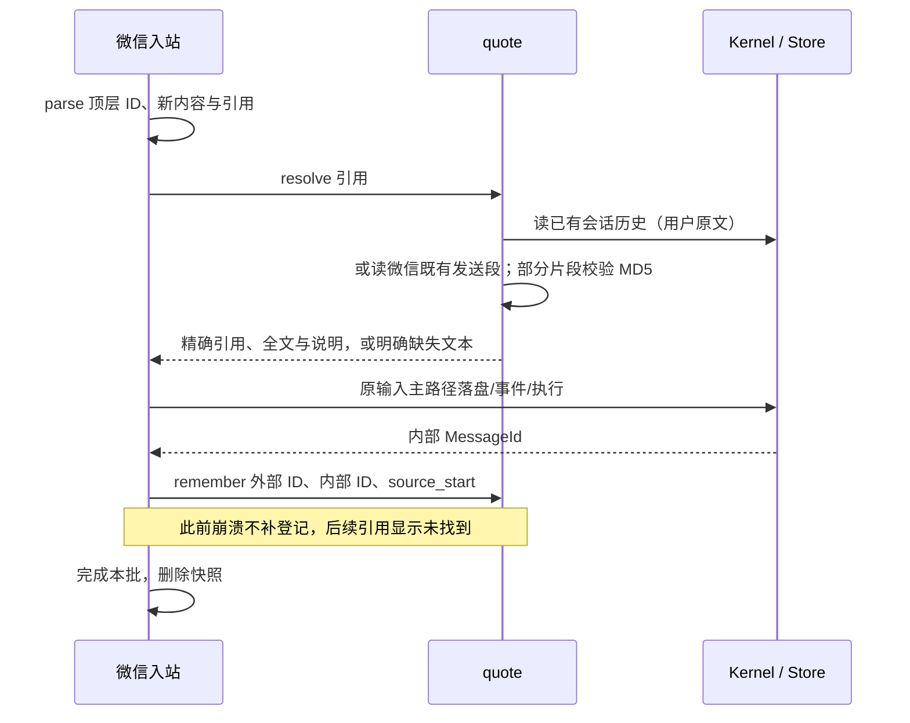
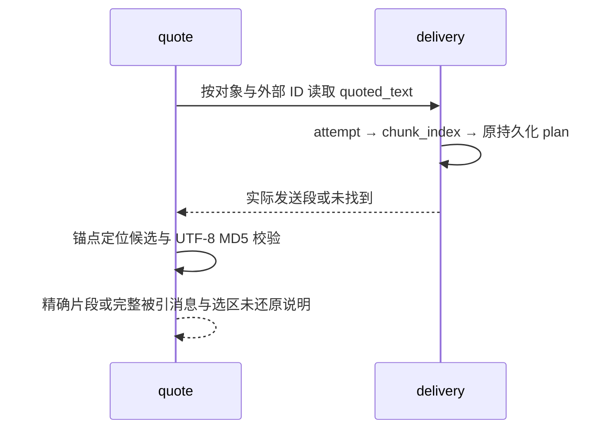

# B2：微信引用回复

**状态：CLOSED（2026-10-10，服务器人工验收通过）。仅微信模块内部；不新增核心来源登记契约。**

**Markdown 部分引用的边界已由 human 收口：** message 243 样本已证明部分选区按显示文字校验，表格的精确显示格式尚未确定。本步只用原消息文本生成候选并校验 MD5；无法精确还原选区时提供完整被引消息，显式注明选区未还原。不开辟微信渲染器重做路径，不声称已精确支持所有 Markdown 选区。该限制不阻塞本稿实施范围，详见下文失败行为。

**已知 bug，human 明确延期（2026-10-10）：** Markdown/表格的部分引用可能无法精确定位，仅能提供全文；优先级低，后续有空再处理，不作为本轮 CLOSED 的阻塞项。普通文本部分引用与明确的全文降级仍属于本轮验收范围。

来源：[V2 B1](../brainstorm/wechat-v2.md) §四。human 已决定引用关联与解析归微信，正文与内部 MessageId 继续复用 core。本 B2 因新增微信内部 `quote` 模块及其跨模块调用而起草，不新增 crate 或跨 crate 依赖。

## 一、已验证的协议事实与范围

- 引用用户文字：原入站顶层 `message_id=7514585484160251144`，引用 `ref_msg.message_item.msg_id` 相同；item ID 是另一套 `v1:…` 标识，不用于本次引用关联。
- 引用用户图片：原入站顶层 `message_id=7514585726439989128`，引用 ID 相同。
- 引用 bot：用引用 ID 查既有出站 attempt，再按 `chunk_index` 读取持久化发送计划；一个内部消息可有多个外部 ID。
- 部分引用：固定原文 `看甲用。看乙用。看丙用。`，选择 `看乙用` 时 start=`看`、end=`用`、两个 index 均为 1；片段 UTF-8 MD5 为 `11409f8325b269b33af44bb68fa1243b`，与样本一致。全文计数规则匹配；相对 end 计数得到另一候选，由 MD5 排除。
- 正常入站快照成功导入后立即删除。不能以批次快照为引用库，不保留快照来绕过关联缺失。
- 接文字引用、bot 发送段引用、图片占位引用、部分文字引用。图片引用本步只表达图片类型，不下载图片、不向模型提供像素；图片输入另一步推进。

## 二、行为与失败边界

微信将每个引用解析成独立 Text 片段，以 `[引用：…]` 前缀放在本条原始内容之前；多个引用保持其原 item 顺序。原始文字、转写和媒体占位的相对顺序不变。

- 普通文字引用还原原消息的内容；bot 引用还原实际发送段，不重新分段。
- 图片引用为 `[引用：[图片]]`；本条新文字仍正常执行，不因所引用对象是图片而把本条变成 held 输入。
- 部分文字引用优先放经过 MD5 校验的片段；定位或 MD5 校验不通过时按 human 决定提供完整被引消息，格式为 `[引用：{全文}]\n[引用说明：部分选区未还原，已提供全文。]`。这里的全文是原微信消息；bot 分段回复取被引用的实际发送段，不展开整个内部 Reply。含 Markdown 时本步按真实发送/原输入文本定位，不猜 Markdown 转换规则，失败仍可保留原消息信息。
- 找不到关联（服务未采集的历史、旧版本输入、崩溃窗口等）明确表达 `[引用：原消息未找到]`。这属于可遇到的引用缺失，不冒充协议成功，不阻止本条新文字执行。
- 协议必需字段缺失、引用 ID 不是十进制 uint64、磁盘版本/类型不匹配、关联指向的 core 消息缺失或归属不符、数据库写入失败均返回 Err，沿既有 Service 错误路径退出；不吞错误。
- 已准入入站顶层 `message_id` 必需；不使用 item ID 或时间/正文猜测。`title/svr_id/message_item/partial_text` 等上游字段继续完整接收；本版按已观察到的 message_item ID 路径解释引用，不新增猜测优先级。

输入正文沿既有 Kernel 主路径落盘与发布，然后微信登记关联，登记成功才继续处理下一条入站。两次事务之间崩溃可能留下有正文但无关联的消息；重启不重导 batch、不补登记、不重跑输入。后续引用明确显示未找到。本步接受这个窗口，不引入恢复机制或改变已有至多一次导入边界。关联登记失败仍退出，不标本批导入完成。

## 三、私有模块契约与依赖

新增 `crates/mic-channel-wechat/src/quote.rs`，`lib.rs` 私有声明 `mod quote;`。以下均为 crate 内 API，不由 lib.rs re-export：

```rust
// client.rs：在协议边界生产，quote 消费。
pub(crate) struct QuoteRef {
    pub id: wire::MessageId,
    pub partial: Option<wire::PartialText>,
}

// quote.rs
pub(crate) async fn resolve(
    kernel: &Kernel,
    account: &Account,
    references: Vec<QuoteRef>,
) -> Result<Vec<IncomingPart>, AccountError>;

pub(crate) async fn remember(
    kernel: &Kernel,
    account: &Account,
    external_id: wire::MessageId,
    message_id: mic_message::MessageId,
    source_start: usize,
) -> Result<(), AccountError>;

// delivery.rs 新增；复用其 Plan 与磁盘版本解析，一处定义分段协议。
pub(crate) async fn quoted_text(
    kernel: &Kernel,
    user: &WechatUserId,
    external_id: wire::MessageId,
) -> Result<Option<String>, AccountError>;
```

`resolve` 的最终消费者是 service 输入组装；`remember` 的消费者是后续微信引用解析；`quoted_text` 的消费者是 quote。`AccountError` 复用当前错误收口，不新增公开错误枚举。正常未找到生成明确缺失文本；部分校验失败提供全文并显式说明；数据损坏由 Err 区分。

client 的 `IncomingMessage` 增加强类型顶层 external_id 与 references；在 HTTP/磁盘响应解释边界一次解析引用，引用字段不再只校验后丢弃。wire 私有类型按需增加 Clone/比较能力；引用 ID 沿用微信私有 uint64 类型，不能与 core MessageId 混用。

service 先由既有 flatten 得到原内容与不支持类型，再由 quote 得到引用前缀；记录前缀片段数 `source_start`，拼接后按原本的新内容决定 Pending/held。登记关联时保存 source_start；后续引用正规消息时仅取该位置之后的原内容，避免把已展开引用当成本条原文，破坏部分引用的出现次数。

依赖方向：service → client/account/quote/delivery；quote → client/account/wire/delivery；delivery 继续使用 account/wire；client 继续使用 account/wire，不依赖 quote。QuoteRef 定义在最早解析它的 client，quote 引入 client::QuoteRef；不得为此引入 client ↔ quote 环。

新增外部依赖 `md-5`（RustCrypto，与已有 Rust 生态库同类）；只用于匹配微信协议要求的 MD5，不承担安全认证。固定算法规则留在 quote，数值旋钮集中 limits；不增加运行期设置。

core/store/message/gateway/provider 的公开类型、签名、事件与执行路径不变。读取正规消息使用已有 `Kernel::messages_after` 会话历史能力，首版允许一次引用解析读取本会话历史的线性开销，不越过模块表边界直接查询 core 表；实际出现性能摩擦后再审薄的共享读接口。

## 四、持久化

微信迁移 v2 增加 `wechat_inbound_message`：

| 字段 | 含义 |
|---|---|
| message_id | 主键，引用 core_messages.id |
| user_id | 引用 wechat_account.user_id |
| external_message_id | 微信顶层外部 ID，十进制 TEXT |
| source_start | 原消息内容在 UserInput.parts 中的起始位置，非负 |

索引 `(user_id, external_message_id, message_id)`。只存关联与片段元数据，不保存另一份正文，不回填已删除快照对应的历史。外部 ID 不设唯一约束，维持原有无入站去重契约；同一外部 ID 若重复导入，按最早已登记的内部消息读取，不新增去重、覆盖或重试机制。

磁盘行在 quote 边界解析/读取；正规消息类型及 source_start 的合法性属于磁盘契约，不合法 Err。本对象读自身关联与投递尝试，不跨账号查询。source_start 后的 Text 按原顺序合并；已有媒体占位仍来自同一正规消息。

出站不新增关联表；delivery 按本对象和外部 ID 查 attempt，读取已有版本化 plan 的对应段。成功发送的某段即使整条最终 skipped，仍可被引用；不以整条 sent 过滤掉用户已经收到的段。

## 五、实体与关键场景

| 实体 | 唯一写者 | 状态 |
|---|---|---|
| 正规输入正文 | 既有 Store append | 未落盘 → 已落盘 |
| 微信入站关联 | quote::remember，由单个入站任务调用 | 未登记 → 已登记；崩溃可停在正文已落盘/关联未登记 |
| 接收批次 | 既有入站/启动收尾 | importing → completed 后删除，或 interrupted 保留 |
| 发送计划/尝试 | 既有 sender | sending → sent/skipped/interrupted；每段尝试成功/失败/未知 |
| 引用解析 | quote::resolve | ID 查找 → 原文 → 普通引用/部分校验 → 前缀；缺失 → 明确占位；部分校验失败 → 全文与说明 |





不变量：正文不重复保存；内部与外部 ID 语义独立；本对象关联不能读其他对象历史；原内容与展开引用分开索引；成功快照清理不影响已登记引用；引用图片不改变新文字执行策略；不新增 runner/event/终态，不改变重启不补跑、不补发与失败预算。

## 六、全部调用方与兼容

| 调用方 | 变更/兼容 |
|---|---|
| lib.rs | 私有声明 quote，不扩大 crate 公开 API |
| client::parse_updates | 生产 external_id/references，删除两条临时采样日志；返回私有 IncomingMessage 新字段 |
| account::recover_batches | 仍调用 parse_updates；完整旧磁盘快照在边界解析，缺必需 ID 明确 Err，不静默迁移 |
| service 入站循环 | 唯一 IncomingMessage 消费者；引用组装、沿既有 append 路径，再登记关联 |
| account::MIGRATIONS / install | 增加 v2 表，仍复用现有迁移登记 |
| delivery | 新增只读引用段查询，发送执行、计划与尝试写入不变 |
| core/store/message/gateway/provider/typing/login/bin | 公开调用不变，无新增引用分支或框架接口 |

## 七、验收与关闭

实现后 cargo fmt、cargo clippy -- -D warnings；改动覆盖已有测试才跑对应测试，不为本功能默认新建测试。

服务器一轮验收：自己的新文字、bot 回复、自己的新图片、重复锚点部分引用四项；微信与 Web 正规历史和模型输入都显示相应引用前缀。图片引用后的文字正常执行。长 bot 回复引用第二段还原对应段。重启后新登记关联与旧出站记录仍可引用；升级前未登记用户消息明确显示未找到。Markdown/表格选区 MD5 不匹配时保留完整被引消息并显式说明选区未还原；数据库/版本错误不伪装成未找到。

确认正文仅在 core、微信只存关联，临时 identity/quote 采样日志已删除；成功快照仍清理，不产生新 runner/event/终态。全部人工验收通过再标 CLOSED、更新 todo。

本地实现验收（2026-10-10）：隔离临时数据目录，经真实 Assembly/Kernel/Store 调用验证自己的文字、图片占位、已发送的第二段（整条 skipped 仍可引用）、重复锚点部分引用、引用前缀不计入原文、MD5 不匹配时全文与说明、缺失占位、账号隔离；重启后再次读取同一关联与出站段均通过。先建微信 v1 数据库再启动 v2，迁移通过；成功 batch 快照仍删除；缺入站 ID、非数字引用 ID、非法 MD5 均明确 Err。临时验收 example 与数据目录已删除，不增加长期测试或生产入口；微信 crate 无既有测试文件。`cargo tree -p mic-channel-wechat --depth 1` 确认内部依赖不变。

移除采样日志的四项核对：引用规则有实测依据且正文进入正规输入（正确性）；不再记录引用协议正文与入站 ID 临时样本（隐私边界）；协议/数据库错误仍 Err、未找到与部分降级显式进入对话（失败行为）；入站关联、core 原文及发送计划/尝试保留（可审计性）。
