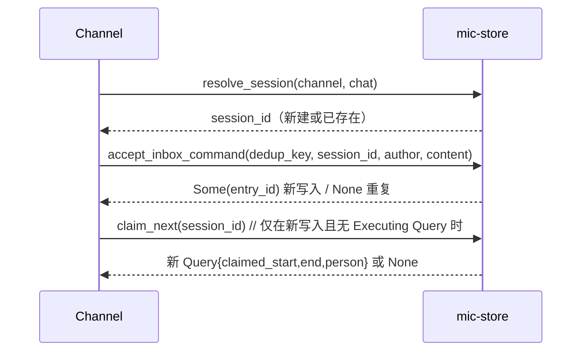
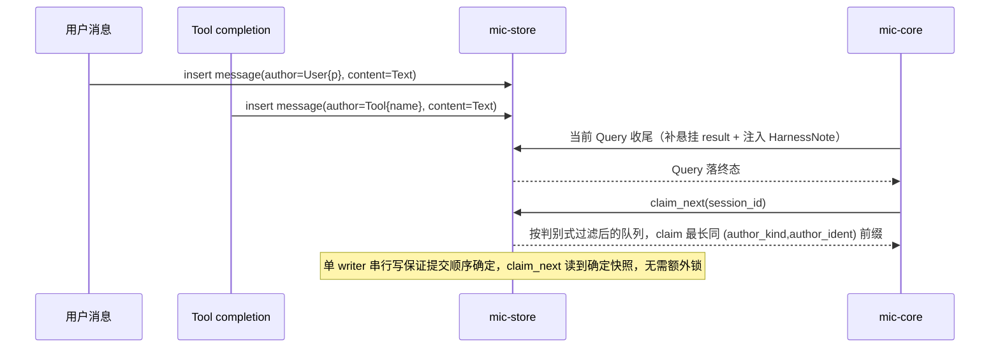

# B1: mic-store 设计

**状态**: 历史 B1 论证；现行契约以 [`mic-store` B2](../blueprints/mic-store.md) 为准
**创建**: 2026-08-26 · **修订**: 2026-08-26（交叉验证 7 条全部并入）
**阅读提示**: 本文的候选、旧 Channel 例子和待办不继续维护。
**范围**: `crates/mic-store`——sessions→queries→session_entries 三层持久化的物理
schema、claim 算法在存储层的实现形状、`resolve_session`/`accept_inbox_command`
两个组合操作。实体清单、Query 状态机、不变量 I1-I4 已在
[`next-gen-architecture.md`](next-gen-architecture.md) §三/§五/§7.4 定好，这里
不重复，只处理"落成 SQL/Rust"时冒出来的新候选。

## 一、涉及的实体与写者（复用，不重新建模）

直接沿用架构文档 §五唯一写者表：`Session`（创建/pwd/队列消费）、`Message`（入站/
产出/completion）、`Query`（创建即带 claim 区间+终态）、`delivered_at`、
`ContextBoundary`（压缩/`/clear`）、`CronJob cursor`。`Query` 沿用 §7.4 的
`Executing` + 三个终态（`Completed`/`Failed`/`Cancelled`）。**`CronJob` 表本轮
B1 不展开**——架构文档 §六明确标注"store/service 是否仍分两层待验证"，这是一个
尚未收敛的独立变化轴，等 cron 子系统单独立项时再定。

## 二、候选 1：SQLite 访问库

| 候选 | 优点 | 缺点 |
|---|---|---|
| `rusqlite`（同步，`spawn_blocking` 包装） | API 薄；单文件 SQLite 单 writer 本身不需要连接池；无联网的编译期检查 | 异步人体工学差一点 |
| `sqlx`（异步原生，`sqlite` feature） | 原生 `async`；`query!` 宏可选编译期校验 | 编译期校验依赖联网或本地 `.sqlx` 缓存；连接池/多 writer 能力本项目用不上 |

**倾向 `rusqlite` + 单连接串行访问**：单进程个人工具，SQLite 本身单 writer 串行，
`sqlx` 的池化能力是杀鸡用牛刀；`spawn_blocking` 包装封在 `mic-store` 内部，调用方
看到的仍是 `async fn`。

## 三、候选 2：`session_entries` 物理表设计

`mic-message::SessionEntry` 是 `Message ∪ BoundaryEntry` 的判别式 enum。

**候选 A：两张表共享一个序列**——SQLite 原生不支持跨表共享自增列，要么应用层显式
管理序号，要么两表各自 `AUTOINCREMENT` 再靠应用层保证不重叠（脆弱）。**排除**：
为共享一个排序键人为制造序列管理复杂度。

**候选 B（采纳）：一张 `session_entries` 表，判别列 + JSON payload**：

```
session_entries(
  id            INTEGER PRIMARY KEY,   -- 即 SessionEntryId，rowid 天然自增
  session_id    INTEGER NOT NULL,
  entry_kind    TEXT NOT NULL,         -- 'message' | 'boundary'
  author_kind   TEXT,                  -- 'user'|'assistant'|'tool'|'harness_note'
                                        -- |'notification'；boundary 行 NULL
  author_ident  TEXT,                  -- User.id / Assistant.id / Tool.name /
                                        -- Notification.source；HarnessNote 与
                                        -- boundary 行 NULL
  content_kind  TEXT,                  -- 'text'|'tool_call'|'tool_result'
                                        -- |'completion'|'attachment'；
                                        -- boundary 行 NULL
  payload       TEXT NOT NULL,         -- message: MessageContent JSON
                                        -- boundary: ContextBoundary JSON
  created_at    INTEGER NOT NULL,
  delivered_at  INTEGER                -- boundary 行恒 NULL，不参与投递
)
```

**`author` 无损还原（交叉验证第 1 条）**：原方案只存 `author_kind`，
`User.id`/`Assistant.id`/`Tool.name`/`Notification.source` 全部丢失，且 claim 按
`author_kind='user'` 分组会把群聊里不同 Person 混成同一 author，直接破坏
`A1,A2,B1` 的分批语义（架构 §4.5）。修正为 `author_kind` + `author_ident` 两列：
`MessageAuthor` 当前每个变体至多一个字段，这两列**已经无损**，能完整还原整个
enum，不需要再额外存一份 author JSON（存了反而是同一事实的第二份记录）。
**触发迁移的条件**：`MessageAuthor` 将来出现有 2 个及以上字段的变体时，这两列
不再够用，届时改为存完整 author JSON + 窄投影列；当前无此需求，不预留。

`content_kind` 单独成列同理——claim 判别式（见下）和可靠投递扫描都要在 SQL 层
按内容类型过滤，塞进 JSON 就得全表扫描反序列化。`payload` 整体存 JSON 而不拍平
成列：`MessageContent` 的字段随变体变化，拍平会造出大量恒 NULL 的稀疏列，整体
JSON 直接复用 `mic-message` 的 `Serialize`/`Deserialize`，序列化只有一处真相。

这四个判别列都是**写入时从 `Message` 投影出来的查询索引，不是第二份领域真相**：
只在 store 的插入函数一处生成，任何一列都不允许被独立更新。

## 四、候选 3：可 claim 判别式（交叉验证第 2 条，本轮最关键的收敛）

架构文档 §4.5 原文"任意未 claim message"过宽。真实问题：`author=Tool` 同时覆盖
两种东西——当前 Query 内产生的普通 `ToolResult`（不该触发新 Query），和
`wait=false` 完成后注入的 completion message（必须触发新 Query，§八-3）。只按
`author_kind='tool'` 过滤，每轮正常工具调用结束都会被重新 claim，死循环。

同理，Assistant 的输出、`HarnessNote`、`Notification`、boundary 也都排在 cursor
之后，如果不精确排除，同样会被误 claim。

**收敛结论——`MessageContent` 新增第五个变体
`Completion { exec_id, outcome }`**（架构 §4.9 闭集从四类扩到五类，已同步）。
最初打算用 `author=Tool` + `content=Text` 承载 completion，但 `Text` 没地方放
`exec_id`，架构 §4.8 要求的"配对 tool_call 与 completion"就只能正则扒散文——
同时跑三个后台任务时分不清哪条对应哪个。有了专门变体，判别式也更干净：

```sql
entry_kind = 'message' AND (
     (author_kind = 'user' AND content_kind IN ('text', 'attachment'))
  OR content_kind = 'completion'
)
```

- `User` + `Text`/`Attachment`：入站用户消息。**`Cron`/`Task` 的起始消息也落在
  这一条里**——架构 §八-2 起始消息代表 `CronJob.creator`、§4.3 `Task` 沿用创建者
  Person，两者 author 都是 `User{那个 person}`，不需要为"起始消息"单列一条规则。
- `content_kind='completion'`：`wait=false` 的终态回报，不必再看 author。
- 其余一律不可 claim：`Tool`+`ToolResult`（普通工具结果）、`Assistant`（模型
  产出）、`HarnessNote`、`Notification`、所有 boundary。

**终态类型共用**：`wait=true` 回填原 tool call 和 `wait=false` 的 completion
拿到的是同一种终态，`mic-message` 提取为 `ExecOutcome`
（`Completed`/`Failed`/`Cancelled`），`ToolResultOutcome` 收窄为
`Terminal(ExecOutcome) | Dispatched{exec_id}`。这样 `Completion` 不可能携带
`Dispatched`（那是个永远非法的状态），也不用把三个终态变体复制两份。

**异步任务的中间进度不落盘**：执行实例的 stdout 攒在内存句柄上，"跑到哪了"
由查询工具直接读句柄回答，不进 `session_entries`。落盘中间态等于请回架构 §六
砍掉的逐条落盘写路径，且每条进度都得小心排除出 claim 判别式（否则每个 stdout
chunk 触发一次新 Query）；收益仅限"崩溃时保住部分输出"，太薄。真需要时加一个
不可 claim 的进度变体是纯增量，不用返工。

**注意与 micbot 的差异**：架构 §六写 micbot 的异步完成通知是"写一条 Notification
message"，那个形状**不能直接搬过来**——本项目已把 `Notification` 定义为"只投递、
不参与 claim"（`mic-message` B2 §三），completion 若用 `Notification` 就永远不会
触发父的新 Query，与 §八-3 直接矛盾。这是重新定义 author 语义后的连带修正。

## 五、候选 4：claim 区间怎么存（交叉验证第 3、4、5 条）

原方案在 `Session` 上存 `claim_cursor`，同时在 `Query` 上存 `claimed_start_id`/
`claimed_end_id`——**两份可能矛盾的状态**，还附带一条只为维护它而存在的不变量，
换来的只是省一次很便宜的查询。且原文对 cursor 的定义自相矛盾（"下一个待考虑的
id"、"更新为 `end + 1`"、"`id <= cursor` 算已 claim"三条并存，`end+1` 那条未处理
的 entry 会被误判为已 claim，off-by-one）。

**修正：删掉 `Session.claim_cursor`，claim 下界直接从最新 Query 推导**：

```sql
SELECT claimed_end_id FROM queries
WHERE session_id = ? ORDER BY id DESC LIMIT 1
```

无此行（该 session 还没有过 Query）则下界为 0。`claim_next` 仍在**一次事务**内
完成"读下界 → 按判别式扫最长同 author 连续前缀 → 插入 Query"，语义无损，少一份
状态、少一条不变量。

**`claimed_start_id`/`claimed_end_id` 的精确语义**：不是"区间内所有行"——
`id` 是跨 session 的全局 rowid，区间里既可能夹着别的 session 的行，也可能夹着
本 session 的不可 claim entry（assistant 输出、boundary 等）。区间的意思是：

```sql
session_id = ? AND id BETWEEN claimed_start_id AND claimed_end_id
              AND <上面的可 claim 判别式>
```

"最长同 author 连续前缀"里的"连续"，指的是**在可 claim 输入队列上连续**（即
按判别式过滤后的序列上相邻），不是物理表里相邻。分组键是
`(author_kind, author_ident)`——这样群聊里 `A1,A2,B1,B2,A3` 才会正确切成三个
Query，两个不同工具的 completion 也各自成 Query。

## 六、候选 5：`resolve_session` 原子 get-or-create

场景：钉钉 webhook 可能并发到达同一个 `(channel, chat)`，只能创建一个 `Root`
session。`sessions` 对 `(kind='Root', channel, chat)` 建唯一索引，用

```sql
INSERT ... ON CONFLICT(channel, chat) DO UPDATE SET id = id RETURNING *
```

一条语句拿到行（新建或已存在都返回同一行）。**排除**"先 SELECT 再 INSERT"——
两次往返之间有竞态窗口。`Cron`/`Task` 的创建路径是单一写者，不存在并发
get-or-create 需求，不套这个模式。

## 七、入站去重：本轮不做，记为已知缺口

**结论：不做**。原因是调研了同形态的隔壁项目（钉钉 agent，长期在跑）：

- 它同样没有任何入站幂等保护（store 无消息唯一键、`msgId` 只用于附件名/引用/
  用量统计），但**从未发生过重复投递或重复执行**。
- 零发生的主因它自己写出来了：**收到回调后立即 ACK，不等模型跑完**，重试窗口
  从"一次模型调用的几十秒"压到"写一次库再返回 200 的几毫秒"。
- 该项目的分析是代码审计，证明的是"这条路径没有防护"，不是"这件事会发生"——
  两者不能混为一谈。它列的"多实例/回调消费层重复交付"对本项目不适用，micnext
  明确单进程单实例。

按"不为假想问题上机制"，零观测 + 毫秒级窗口的情况下现在建 dedup 表就是提前
上机制。**关键是补起来的代价极低**，所以推迟风险很小：

```sql
ALTER TABLE session_entries ADD COLUMN channel_kind TEXT;
ALTER TABLE session_entries ADD COLUMN dedup_key TEXT;
CREATE UNIQUE INDEX idx_inbox_dedup ON session_entries(channel_kind, dedup_key)
  WHERE dedup_key IS NOT NULL;
```

非破坏性、不重写表、**不需要回填**（老 entry 本来就没有 dedup key，NULL 是合法
事实而非数据缺失）；加上 `accept_inbox_command` 签名多一个参数、Web 前端生成
UUID 五行 JS。真出现重复再补，不会有历史包袱。

补的时候写入语句用**指定冲突目标**，不用宽泛的 `INSERT OR IGNORE`（交叉验证第
6 条：`OR IGNORE` 会把 NOT NULL、外键等非 dedup 冲突一起静默吞掉，与 Fail Fast
冲突）：`INSERT ... ON CONFLICT(channel_kind, dedup_key) DO NOTHING RETURNING
id`，有行=新写入、无行=重复且**不触发 `claim_next`**。

### 但必须现在写死的前提：落盘即 ACK

**Channel 收到入站消息，写库完成后立即返回 ACK，不等 Query 执行完。** 这是把
重复概率压到近零的真正原因，是结构性质、不花任何成本，比 dedup 表本身重要得多。
micnext 的架构天然如此（§八-1 是"落盘 → claim → 异步执行"），但要在
`mic-channel-*` 的 B2 里明确写成契约——一旦有人图省事改成"等模型回复完再 ACK"，
重试窗口立刻从毫秒回到几十秒，重复会从"从没见过"变成"经常"。

## 八、关键场景 sequence

### 场景 1：用户发消息（架构 §八-1）



### 场景 5：插嘴与异步完成几乎同时到（架构 §八-5）



注入的 `HarnessNote` 和上一轮的 assistant 输出、tool_result 都被判别式排除，
不会污染这次 claim。

## 九、必须成立的不变量（新增，不重复 I1-I4）

- **S1**：同一 session 的 Query，`claimed_start_id` 严格大于上一个 Query 的
  `claimed_end_id`——claim 区间单调、不重叠、不回退（由 `claim_next` 在单事务内
  读下界+插入保证）。
- **S2**：`(kind='Root', channel, chat)` 全局至多一行 `sessions`。
- **S3**：`accept_inbox_command` 对同一 `(channel_kind, dedup_key)` 至多产生一条
  `session_entries` 写入。
- **S4**：`queries.person_id` NOT NULL——每个 Query 都有一个负责的 Person。
  completion 触发的 Query 取"触发那次 tool call 的 Query 的 person"，不取
  session creator 或默认值（否则是提权路径，见架构 §4.5）。store 不需要为此
  反查：person 由 `mic-core` 从内存中的执行实例句柄带入。

## 十、未纳入本轮 B1 的范围

- `CronJob` 表结构、cursor 推进——架构文档标注"待验证"，独立变化轴，另开 B1。
- `mic-store` 对外函数签名、错误枚举——留到 B2。
- Web Push/离线通知存储模型——架构 §十-13，依赖 `mic-channel-web` 选型。
- 索引/性能调优——当前数据量级不构成问题，出现真实瓶颈再看。

---

## 已确认（第三轮）

1. **`rusqlite` + 单连接串行访问**，`spawn_blocking` 封在 crate 内部。
2. **`session_entries` 单表 + 判别列 + JSON payload**；author 用
   `author_kind`+`author_ident` 两列无损表示，不另存 author JSON。
3. **删掉 `Session.claim_cursor`**，claim 下界从最新 Query 的 `claimed_end_id`
   推导。

## 已确认（第二轮）

5. **入站去重本轮不做**（见§七）：隔壁同形态项目长期零发生，且立即 ACK 已把
   窗口压到毫秒；补起来是纯增量 `ALTER TABLE`，不需要回填。改为写死"落盘即
   ACK"这条契约，留给 `mic-channel-*` B2。

4. **completion message = `MessageContent::Completion{exec_id, outcome}`**
   （闭集扩到五类），claim 判别式按 `content_kind='completion'` 判，不看 author。
   异步任务中间进度不落盘，"跑到哪了"由查询工具读内存句柄回答。
6. **`Query.person`**：每个 Query 都有一个负责的 Person（S4）；completion 触发
   的 Query 沿用触发那次 tool call 的 Query 的 person，理由是防提权。person 由
   `mic-core` 从内存执行实例句柄带入，store 不反查。

## 交叉验证修订记录（第一轮，7 条全部接受）

1. `author` 无损还原：加 `author_ident` 列，claim 分组键改为
   `(author_kind, author_ident)`，修复群聊 Person 混淆。
2. 可 claim 判别式精确化：新增 §四，定死 completion message 形状，排除普通
   `ToolResult`/Assistant/`HarnessNote`/`Notification`/boundary。
3. cursor off-by-one：连同第 4 条一起，删掉 cursor，问题消解。
4. `claim_cursor` 与 `Query.claimed_end_id` 重复存储：删掉 cursor，下界从最新
   Query 推导，原 S1 不变量随之删除。
5. claimed range 语义：明确为"同 session + 区间内 + 满足判别式"，"连续"指可
   claim 队列上连续，不是物理表相邻。
6. `INSERT OR IGNORE` → `ON CONFLICT(...) DO NOTHING RETURNING`，不吞非 dedup
   约束错误。
7. "三态"文案订正为"`Executing` + 三个终态"。
