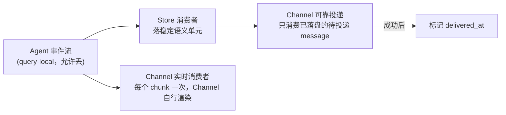
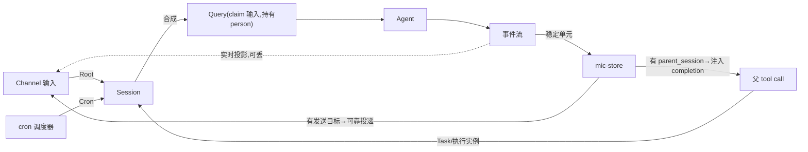
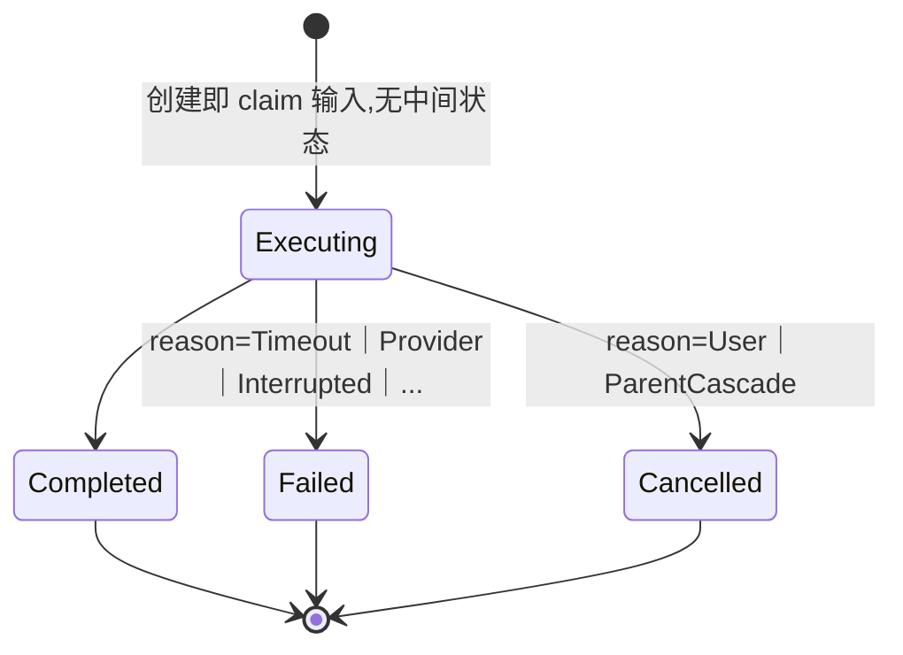

# Brainstorm: 新一代 agent 架构（暂定项目名待定）

**状态**: B1（头脑风暴，不写代码）
**创建**: 2026-08-25
**背景**: 见 [[micbot-rearchitecture-retro-2026-08]]（memory）与 `docs/project-positioning.md`。

## 一、定位事实

- 单进程个人工具，长期维护，不做多实例/分布式。
- 全新独立仓库，不复用 micbot git 历史；micbot 保留作参考。
- 渠道：新增 **Web**（公网，含手机）；**钉钉整体复用**现有逻辑，改接统一协议；
  TUI/MCP 砍掉；Telegram 先砍，接口留口子。
- 鉴权：Web 固定口令/token、单 Person；钉钉群里多 Person（不同 sender），
  权限与 cron 归属按 Person 区分。
- Web 聊天 + 主动推送两种场景权重相近。先做单 session，但 session 管理
  （列表/切换）从一开始就在数据模型里，不后补。
- 保留：历史会话、cron、基础工具集、Skill 目录、上下文压缩、token/费用统计。
- 砍：工具执行前的人工审批闸门，改为启动期一次性白名单/ExecutionWrapper 策略。
- SQLite（WAL，单 writer 串行写）；配置全部重启生效，不做热更新。
- 模型接入：自定义 base_url+key（OpenAI 兼容）、DeepSeek 官方。
- 崩溃语义：简单失败语义，不做事务型 job 系统/checkpoint 重放（4.7）。

## 二、设计原则

1. 少数正交原语，靠组合涌现行为——不为每个触发源焊专属路径。
2. 功能即插件——`Tool` trait 的"实现 + 注册"形状原样带过来。
3. 能力是对执行的包装，不是新概念——sandbox 包一层执行，推送是 Channel 的一种消费方式。
4. 一处真相——SQLite 是**已提交事实**的唯一来源；实时展示事件是投影，不是事实（4.6）。
5. 不为假想扩展性上重机制——多 provider、推送协议只做当前明确要的最小实现。

## 三、原语一览

| 原语 | 职责 | 边界 | 依赖 |
|---|---|---|---|
| **Person** | 行为与权限主体，与 Session 正交：工具权限、上下文角色隔离、（将来）工作区隔离、cron 归属 | 不是发送目标；Session 不"属于"某个 Person | — |
| **Session** | 消息历史、投递地址的容器：`parent_session_id`、`kind`、发送目标、pwd、tool 收窄集 | 不做推理；不普遍归属某个 Person；不跨 session 读对方运行时状态；**不持久化待执行队列**——待执行的是"尚未被任何 Query claim 的 message"，队列从 message 表派生，见 4.5 | — |
| **Message** | Session 内一条事实，沿用当前项目的 `MessageAuthor` provenance（User/Assistant/Tool/Harness/Notification） | 不归属 Query（Query 只标记自己 claim 的区间） | Session, Person |
| **Query** | Session 的一次执行（一轮 agent 循环），**创建即 `Executing`**，创建时一次性 claim 最长的同 author 连续未 claim message 前缀，无中间可变状态 | 不带 `trigger` 字段——"我因何而生"写在所属 Session 上；不存在 `Created` 状态，claim 区间创建后不再漂移 | Session, Person, Agent |
| **ExecutionContext** | **每次 Query 执行前合成的值**，非存储实体：session 侧`发送目标+pwd+tool 收窄集` ⊕ 本次 `person` → `tool_allow = person 权限上限 ∩ session 收窄集` | 不含消息历史；不落盘 | Session, Person |
| **Agent** | 无状态模型-工具循环；输入 `{system prompt, 上下文, Tool 子集, 模型配置}`；输出事件流 | 不知道 Session/Channel/Person，不落盘，不发送 | 注入的 Tool 子集 |
| **Tool** | 插件化能力单元；长任务接受 `wait` → `ToolOutcome::Completed`/`Dispatched`（立即闭合本次 tool call） | 不做发送路由——push/notify 是普通 Tool | — |
| **执行实例** | 长工具（`run_shell` 等）自己的异步执行句柄：PID/stdout/exit status/signal，只活在内存里 | 不是 Session，不跑模型，不持久化独立状态表——"是否在跑/跑完没"从"对应 `tool_call` 有没有配对的 completion message"派生（4.8）；只在"完成后往父 session 注入 message"这个末端汇合 | Tool |
| **ExecutionWrapper** | 包装 Tool 执行的装饰器（sandbox/bwrap） | 不是新 Tool，不改变 Tool 接口 | Tool |
| **CronJob** | 定时定义 + 父 session + creator Person | 到点只创建一个 tick Session，不直接执行/发送 | Session, Person |
| **Channel** | 输入创建/唤醒 Session；输出=消费实时事件做展示 + 消费已落盘的待投递 message 做可靠投递 | 不做路由决策，不做业务判断 | Session |

**不存在的原语**：Conversation（就是 Session）、通用 Job 实体（agent 子会话是
Session，纯进程任务是执行实例）、`Query.trigger` 枚举（路由由 `kind` + 有无发送目标决定）。

## 四、Session 模型

### 4.1 三种 kind

| kind | parent | 起始消息 | 发送目标 | 谁创建 |
|---|---|---|---|---|
| `Root{channel, chat}` | 无 | 用户这条消息 | 有 | Channel 收到消息 |
| `Cron{cron_id}` | 建 cron 时所在对话 | CronJob 存的 prompt | 有（拷父的持久推送目标） | 调度器到点 |
| `Task{parent_session, parent_tool_call}` | 调它的 session | 父 agent 写好的任务描述 | 无 | 父 session 的工具调用 |

`Task` **只表示 agent 子会话**。`run_shell wait=false` 这类纯进程异步任务**不套 Session
壳**——是工具自己的执行实例（PID/exit status/signal），跟模型 Query 不是同一个生命周期
问题，只在"完成后往父注入 message"这个末端与 Session 世界汇合。

**产出去向两个正交轴，不看 `kind`**：**投递**（有没有发送目标；Task 没有，子 agent
中间过程不会漏到 channel）、**通知父**（有没有 `parent_session`；Cron 没有）。
因此 `Cron` tick 不往父追加、不触发父的新 Query——自己有发送目标，自己投递；父只
提供执行环境与归属，不接收产出。

**`Root.chat` 语义**：钉钉 chat 是外部 id，一 chat 一 Root session 永久累积；Web
chat 自生成，"新建对话"=新 Root session（后果：老 session 挂的 cron 仍投递到老
session，Web 会话列表里多一条，不是丢失，可接受）。

`wait=false`（无论是纯执行实例还是子 agent 委派）只能由 `Root`/`Cron` 发起；`Task`
session 内部只能用 `wait=true`。完成消息永远注入直接父 session，如果 `Task` 内部
还能再发一个 `wait=false`，就会出现"`Task` 已回填父并收尾后，迟到的 completion
注入到一个已经结束、没人再看的 `Task` session"的孤儿问题——统一在源头堵死，不为
这个场景增加 `Session` 的 Closed 状态或额外的孤儿检测机制。

### 4.2 `wait`：父侧消息协议不同，子的执行路径相同

| | 父侧协议 |
|---|---|
| `wait=true` | 原 tool call 得到**唯一一次**终态结果（`Completed`→结果，`Failed`/`Cancelled`→`ToolError`，reason 携带 Timeout/Interrupted/User/ParentCascade 等具体原因），本轮继续 |
| `wait=false` | 原 tool call **立即闭合**于 `Dispatched(id)`；完成后往父注入一条 completion message，父在**后续 Query** 中消费 |

`wait=false` 不能回填原 tool call——它已随 `Dispatched` 闭合，同一 `tool_call_id`
再来一个 result 破坏协议（不变量 I1）。取消级联同样由 `wait` 决定：`true` 的子随父
cancel，`false` 的子不受影响。

### 4.3 「继承」两个正交轴

| 轴 | 内容 | 交接方式 |
|---|---|---|
| 执行环境 | 发送目标、pwd、tool 收窄集 | 子 Session 创建时写入 |
| 起始消息 | 子 agent 要干什么 | 父 agent **主动写好**，不做历史快照 |

`Root`/`Cron` 的 Query person = 入站 message 的 `author`；`Task` 沿用创建者 Person。
"委派"只是父传给子这份 tool 收窄集的动作，不是第二份数据——子 Session 只有一个
tool 收窄集字段，父授予多少，子的字段就写多少（只能收窄，不能扩大，见 I3）。执行
时统一计算 `tool_allow = Person 权限上限 ∩ Session 收窄集`。

不存在"子缺上下文就去读父的"运行时继承链——两轴都在创建那一刻定死。

### 4.4 并发不变量

- per-session 严格串行（同一 session 最多一个 `Executing` Query）；跨 session 并行，
  **不设全局上限**。单进程个人工具的真实并发量级是个位数（用户聊天 + 若干 cron
  到点 + 偶尔一层子 agent），不存在需要限流保护的共享资源池场景；真正的外部瓶颈是
  模型 API 的费用/速率，交给已有的 [BP-038 重试/退避](../blueprints/bp-038-retry-fallback-resilience.md)
  处理，不在 Session 调度层建全局槽位。
- 曾考虑"全局并发上限 + `wait=true` 父 await 期间释放 slot、子完成后重新获取"的
  借还协议，是为了避免假想中的资源竞争/死锁场景而提前建的机制（违反设计原则 5），
  已放弃；真出现 cron 风暴之类的实际问题再按观测到的现象立项。

### 4.5 插嘴

用户消息先入库，落在 message 表里。调度条件不看某个持久队列，直接从 message
表算：**有未被任何 Query claim 的 message，且当前无 `Executing` Query** → claim
最长的同 author 连续未 claim 前缀，创建一个直接 `Executing` 的 Query。不同 author
自然切分：`A1,A2,B1,B2,A3` → 依次 claim 出 `[A1,A2]`、`[B1,B2]`、`[A3]` 三个 Query。
这样 Query 创建后不需要再合并、再冻结——claim 区间在创建那一刻就是最终值。

当前 Query 执行期间不并发消费。语义沿用当前 TUI：不做 streaming 中途硬打断；当前
Query 跑到 turn/工具边界时，**在途 tool_call 必须先补齐配对的 tool_result**（I1），
然后收尾，Session 再从 message 表里 claim 下一批。这个"打断"本身很简单：当前
Query 结束就是 `Cancelled`，新消息开启新 Query，不是什么复杂机制。收尾时额外注入
一条 `Harness`/`Notification` 消息，说明"上一轮执行被新消息打断"；下一个 Query
天然能在上下文里看到这条提示，模型据此先回应新消息，再自行判断要不要、如何继续
被打断的工作——这是模型的判断，不是架构层要解决的问题。

群聊仍共享一个 Root session，但一次 Query 只 claim 同一 author 的连续入站消息；
不同 author 的消息分别排队，不合并进同一 Query。这样 `Query.person` 唯一确定，
`tool_allow` 和插嘴取消都按该 author 生效，不会因为群里另一个人发言而取消当前 Query。

### 4.6 实时事件与持久事实是两条正交的路



- 可靠投递只消费**已落盘**的 message，顺序固定：落盘 → 投递 → 标记 `delivered_at`；
  重启扫 `delivered_at IS NULL` 且有发送目标的 message 补发（"续跑丢回复"在 Channel
  侧的堵死点）。
- 实时事件是给 Channel 的消费结果，不是落盘协议；每个 chunk 尽量只发送一次，
  Channel 自己决定攒段、逐段展示或其它渲染。断线后统一**从 store 回放**稳定事实，
  不靠实时事件重放。可靠投递仍只消费已落盘 message，避免实时投影和可靠投递互相抢发。

### 4.7 崩溃恢复：简单失败语义

SQLite 分不清"没执行"和"执行了但没落盘"，不上事务型 job 系统：启动时把遗留
`Executing` Query 收尾为 `Failed{reason: Interrupted}`；**不自动重放**未知是否已
执行的调用（I4）；`Task` 按终态通知父，`Root`/`Cron` 留可见失败记录；只有明确
声明幂等的操作才重试（入站去重、投递补发）。Store 的承诺是"重建已提交事实并对
未完成 Query 确定性收尾"，不是"重建任意时刻的执行进度"。

这里明确采用 claim 即消费：`Failed{reason: Interrupted}` 的 Query 已 claim 的输入
不释放、不自动 re-claim，用户需要重发。启动时遗留的执行实例（内存句柄已随进程
重启消失）同样按 `Interrupted` 处理；若存在父 session，按普通 completion message
通知父，不尝试猜测进程是否已经产生副作用。

父 Query 被插嘴或级联取消、且正在等待 `wait=true` 子时，必须先让子进入终态并
完成收尾，再补齐父的 tool_result，最后才收尾父 Query；不能先关闭父再回填子结果。

Session 不增加独立的 `Open/Closed` 生命周期状态。**待执行 message 非空且无
`Executing` Query 是调度条件；`Executing` Query 只是 per-session 串行的互斥条件，
不是另一种业务状态。**新输入落 message 表；当前 Query 收尾后从 message 表 claim
下一批，不需要额外的 Session 生命周期状态或 `wake` API 契约。

### 4.8 可观测性

"cron 最近跑得怎样"、"子 agent 当时怎么想"是同一查询：按 `kind`/`parent_session_id`
列 session，读其 messages。纯进程执行实例不持久化独立记录——"命令是什么"在原始
`tool_call` 里，"跑完没/exit code"看有没有配对的 completion message：没有=仍在跑，
有=已完成，内容里带 exit code/输出摘要。查询工具只需要一类对象（message），不用
再区分"session 对象"和"执行实例对象"两套查询路径。

### 4.9 消息类型闭集 + 压缩模型

`text`/`tool_call`/`tool_result`/`attachment`。压缩不新增 `summary` 消息类型，
沿用当前 micbot 已验证的 `Message` + `ContextBoundary` 二元模型：Session 内除
`Message` 外再有一类 `ContextBoundary` 条目（`Compaction{summary, occurred_at}`
/`UserClear{occurred_at}`），上下文构建只读**最后一个 boundary 之后**的
`Message` 窗口 + 该 boundary 携带的 `summary` 文本。原消息不删除、不打
`superseded_by` 之类的逐条标记——它们天然在 boundary 之前，后续上下文构建
自然跳过；历史/回放视图仍展示完整消息事实，不受 boundary 影响。压缩是
per-session 的事，是模型调用前的上下文预处理，不另建 Query、不进 Session
FIFO；手动 `/compact` 只产生一次 boundary 写入和一个普通事件通知，不伪造
Query 记录。

“投递”在本文专指 Channel 消费已落盘 message 后向外部系统发送；实时 chunk 是另一条
给 Channel 的消费接口，不标 `delivered_at`。可靠投递的消息集合只需在 B2 写死：
建议投递 `agent`/`Notification` 作者的 `text`/`attachment` 稳定消息——`Notification`
必须包含在内，否则 misfire notice、`Interrupted` 收尾提示这类用户本该看到的信息
在钉钉侧永远是黑洞；`tool_call`、`tool_result`、入站消息和实时 chunk 不投。落盘
粒度不构成协议约束，单实例下按实现方便增量或批量均可，但有实时连接在等（如 Web
长任务中）时至少按 turn 粒度落盘，避免断线重连回放为空。`delivered_at` 表示外部
系统受理成功，不表示已读；Web 的"可靠投递"就是落盘本身——落盘即视为投递成功、
即置 `delivered_at`，离线 push 只是锦上添花的通知，不是可靠投递路径本身。

Web 重连按 `session_id` 从 Store 回放；是否增加离线 push 及其数据模型留待 B2。

## 五、唯一写者与不变量

| 实体 / 字段 | 唯一写者 |
|---|---|
| Session（创建） | Channel 接入 / cron 调度器 / 父 session 的工具调用 |
| Session（pwd、队列消费） | `execute_query` |
| Message：入站 | Channel |
| Message：agent 产出 | `execute_query` |
| Message：completion 通知 | 子会话/执行实例的完成路径（同一段逻辑） |
| Query（创建即带 claim 区间、终态） | Session 调度路径 |
| `delivered_at` | Channel（投递成功后） |
| Message：`kind=boundary`（创建） | 压缩流程（`Compaction`）/ 用户 `/clear`（`UserClear`） |
| CronJob cursor | CronService |

执行实例没有独立的持久状态字段——运行中只活在工具自己的内存句柄里，完成后的
事实通过"Message：completion 通知"这一行落盘，不再单列写者。

**不变量**：
- **I1** tool call 严格成对且唯一：每个 `tool_call` 恰一个 `tool_result`，
  取消/中断路径必须补齐悬挂的 result。
- **I2** Query 创建即代表已 claim 的输入批次（当前无 `Executing` Query 时，最长
  的同 author 连续未 claim message 前缀）；创建后 claim 区间不再变化，没有可变的
  中间状态。
- **I3** 工具权限统一取 `Person 权限上限 ∩ Session 收窄集`，委派只能收窄。
- **I4** 崩溃不猜测重放，只恢复已提交事实。

## 六、核心模块设计（从 micbot 抽取）

| 模块 | 复用 | 砍 | 为什么 |
|---|---|---|---|
| **Tool** | 静态 `Tool` trait（`Args`+`name()`+`execute()->ToolOutcome`，schema 走 `schemars`）；`ToolError` 三分类 `Input/Business/Dependency`；`ToolOutcome` 两态 `Completed｜Dispatched` | `DynTool` 类型擦除桥（`ErasedToolImpl`） | 唯一消费者是 MCP `RemoteTool`，MCP 已砍 |
| **异步完成通知** | micbot 现有形状：完成后写一条 Notification message，独立铸造一个 query（`agent.rs::instant_completed_finalize`） | `BackgroundJobDone` 一圈 TUI 专属事件 | 正是 4.2 `wait=false` 协议的现成实现；`run_shell` 与子 agent 共用同一段末端逻辑 |
| **Store** | `sessions→queries→messages` 三层（新增 `parent_session_id`/`kind`/`author`/`delivered_at`；`messages.kind` 新增 `boundary` 承载压缩/`/clear` 边界）；`resolve_session` 原子 get-or-create；`accept_inbox_command` 幂等去重 | 逐条落盘的 owner-loop 写路径；`Message.superseded_by` 逐条标记；独立执行实例表 | 表结构和幂等接入跟 owner-loop 无关，owner-loop 只是消费方式之一；boundary 折进 messages 表共享同一排序键，比独立表/逐条标记都简单，见 4.9/4.8 |
| **Cron** | 到点检查并推进 cursor；`CronRegistry` 窄 port | store/service 是否仍分两层**待验证** | 单进程调度不引入 CAS/分布式抢占语义 |
| **Channel 发送路由** | 钉钉 `ReplyContext` 模式：发送目标编码成版本化不透明 payload，随 Session 存 | 常驻 worker + `SessionHandle`/`command_rx`/`SessionCommand{ack}` 接线 | 后者正是 cron owner 丢失、续跑丢回复两个真实 bug 的载体 |
| **Agent 事件流** | streaming chunk / 工具事件基本形状；每个 chunk 尽量只向 Channel 消费一次 | followup 排队合并、`SubAgentProgress` 等 TUI 专属信号 | 插嘴改边界收尾后不再需要；Channel 自己决定渲染 |

落盘只要求已提交事实可恢复；单实例下不规定每 turn/每工具调用的粒度，按实现方便
增量或批量均可。不带入 micbot 为多实例准备的 `begin_query`/`finish_query` 两段式。

Skill 在 **prompt 层**（扫目录、读 `SKILL.md`、注入 system prompt），不是 Tool；
注入 catalog 还是完整 body、是否按需加载见待办 15。

trait 化只覆盖**模型 provider** 和 **Channel**；Store 不 trait 化，测试用内存 SQLite。

## 七、架构图

### 7.1 crate 依赖

```
mic-message           ← 零依赖（L0）
mic-store             ← mic-message
mic-tool              ← mic-message（含自己需要的 port trait，如 CronRegistry）
mic-core              ← mic-message + mic-store + mic-tool
mic-channel-{web,dingtalk} ← mic-core 的 port
二进制                 ← 全部（装配根）
```

Tool 不依赖 Store（port trait 由 core 实现注入，依赖倒置）；Core 不依赖具体 Channel。
对比 micbot 现有十模块：砍 `mcp`/`telegram`/`tui`；`dingtalk` 整体复用改接协议；
`gateway` 收窄为 channel 挂载点；`cron` 折进 `mic-core`。

### 7.2 运行时协作



实线=已提交事实，虚线=允许丢的实时投影。两条出向正交，都不看 `kind`。

### 7.3 可靠投递只有一条路

| Channel | 实时投影 | 可靠投递 |
|---|---|---|
| Web | 逐 chunk 推 WS（临时预览） | 落盘即投递、即置 `delivered_at`；离线 push 是附加通知，重连从 store 回放 |
| 钉钉 | 可选，默认不接——没有独立展示面，攒段的唯一去处就是发消息，会和可靠投递重复发送 | 落盘后发，成功标 `delivered_at` |

实时消费在 `Channel` trait 上是可选能力，默认 no-op，不是每个 Channel 都要实现；
这是 Channel 自己的选择，不是协议约束——钉钉当前不接，但如果它的 API 以后支持
增量编辑/流式回复，接入实时消费也不违反"可靠投递只有一条路"，两者本来就不互斥
（推流是渲染中间态，可靠投递决定最终落盘内容），不需要现在下死结论。

任何 session 有发送目标都走这一条路，与 `kind` 无关——这是"钉钉后台任务不二次
推送"那个 bug 在架构层的堵死点。**发送目标必须是持久的**：存主动推送目标
（钉钉 `robotCode`+`open_conversation_id`，走 `batchSend`，micbot `outbound.rs`
已有），一次性 `session_webhook` 只是有效期内快捷路径，过期自动回落——否则 cron
tick 拷父的回复 webhook 到点必过期。

### 7.4 Query 状态机



只有这 3 个持久状态。原来 `TimedOut`/`Interrupted` 单列成状态，但它们的收尾行为
跟 `Failed` 完全一样（都走同一段收尾、都给调用方 `ToolError`），区别只是"为什么
没成功"这条诊断信息——信息不丢，搬进 `reason` 字段：`Failed{reason}` 覆盖超时、
provider 错误、崩溃恢复收尾；`Cancelled{reason}` 覆盖用户插嘴打断、父级联取消。
"是否在等工具结果"同样不是 Query 状态，是 `Executing` 内部的事实，靠 I1
（tool_call/tool_result 严格成对）保证。收尾也不是状态——是所有终态共用的一段
收尾**动作**，不落盘为字段值：补齐悬挂 result 后，按有无发送目标→可靠投递、
有无 `parent_session` 且 `wait=true/false`→回填原 tool call 或注入 completion
message。所有终态都要走这段收尾，不存在"某终态不收尾"的特例，否则 `wait=true`
的父永远 await。

## 八、关键场景（六场景共用同一 `execute_query` 入口、同一套 Session 表、同一条投递路）

1. **用户发消息**：Channel 落盘 message → 无 `Executing` Query 时 claim 最长同
   author 连续前缀创建 Query → 执行 → 实时投影给 Channel；稳定 message 走可靠
   投递 → 标 `delivered_at`。
2. **cron 到点**：调度器创建 Cron session（拷父持久推送目标；起始消息代表
   `CronJob.creator`）→ 自己跑 Query → 自己的发送目标投递，不碰父。需要父历史时，
   由 agent 通过查询工具显式读取，不做隐式继承。misfire 全跳过，cursor 直推当前，
   落一条 notice；同一 CronJob 上一 tick 尚未进入终态时，下一 tick 跳过并落 notice。
3. **纯进程异步任务**（`run_shell wait=false`）：`Dispatched(exec_id)` 闭合原 tool
   call → 父本轮结束（"已提交"）→ 进程跑完注入 completion message → 父 claim 这条
   message 创建新 Query → 执行 → 同一条投递路。
4. **子 agent**（`wait=true`）：父写任务描述+固化收窄集 → 子自己的 Query/工具循环
   → 唯一终态回填原 tool call → 父本轮继续，历史不含子的中间过程。
5. **插嘴与异步完成几乎同时到**：两条输入按 author 连续性各自 claim → 当前
   Query 边界收尾（补齐悬挂 result，注入"被打断"提示）→ Session 按到达顺序 claim
   后续 message 创建下一个 Query；I2 保证每个 Query 的 claim 区间创建后不再漂移。
6. **副作用工具执行后、落盘前崩溃**：重启发现遗留 `Executing` → 收尾为
   `Failed{reason: Interrupted}`，不重放 → session 里留"上次执行被中断，可能已有
   副作用"，交人/agent 判断。

## 九、前端形态

服务端渲染 + 少量原生 JS，不引入 SPA 框架。页面骨架 Rust 端吐 HTML，消息流式追加、
WS 维持用手写原生 JS。静态资源经 `rust-embed` 编译期嵌入。

## 十、待 B2 拍板

**架构落地**：
1. Web Push 协议（VAPID）还是轮询/未读计数顶替。
2. 鉴权 token 存储与校验细节。
3. cron 调度实现选型；`CronStore`/`CronService` 是否合并。
4. SQLite schema 逐表设计（`parent_session_id`/`kind`/`author`/`delivered_at`，
   `messages.kind=boundary` 的字段形状，Query 如何写下 claim 区间）。
5. `execute_query` 签名、错误枚举；`ToolContext` 拿 `ExecutionContext` 全量还是收窄视图。
6. Agent 事件流的最小事件集合；Channel 直接消费，不做 capability negotiation。
7. 查询工具接口：session 列举（执行实例信息从 `tool_call`+completion message
   派生，不是独立对象，见 4.8）。
8. 钉钉 `conversation_id`→`open_conversation_id` 转换与失效处理。
9. 新仓库命名（目录结构已按本文 §7.1 搭好空壳，见 micnext 仓库）。
10. ExecutionWrapper 接口（参考 PARKED 的 `bp-012-sandbox-runner.md`）。
11. 工具白名单粒度（按 Tool 还是 Tool+参数模式）。
12. Query 超时时长与 cancel 传播点。
13. Web subscription 实体和离线 push 细节。
14. 二进制入口模式：默认只有常驻模式（挂 Web+钉钉 Channel，对应 micbot 的
    `gateway`，TUI 已砍无前台模式）；一次性调试调用（对应 micbot 的
    `chat PROMPT`）留作后续 flag（暂定 `-p`/`--chat`），具体接口形状待定。

**Agent 语义**（不上机制，但要先定语义）：
15. 上下文构建顺序（system/soul/summary/历史/Skill/当前输入）；Skill 注入粒度；
    summary 的展示/投递规则。
16. 停止条件（最大 turn/tool call/token 预算，谁终止）。
17. Provider 失败语义（可重试错误、是否计预算、流中断时未完成 assistant message 处理）。
18. 工具调用协议（parse 失败/未知工具/并行调用/重复 tool_call_id，均须满足 I1）。
19. Tool 结果尺寸边界（超大 stdout/附件/二进制，store 与模型视图两套规则）。
20. usage 归属实体；失败/重试/压缩调用是否计入。
21. 进程关闭顺序（停接入→等待/取消执行中 Query→落终态→停 Channel）。

## 十一、与现有 BP-097 的关系

吸收"去 owner、统一原语"洞察，但**不推到"只剩 Session 一个原语"**——统一的是
query 主路径和投递路径；Person（权限主体）、执行实例（进程生命周期）作为独立
变化轴保留。消掉的是 `Query.trigger`、Conversation、通用 Job 实体。BP-097 的
Redis 共享状态/无锁并发/并行 fork（含两段式落盘）因不符合单进程定位不带入新项目。
micbot 仓库内 BP-097 保持现状；新仓库从这份 B1 文档开始。
